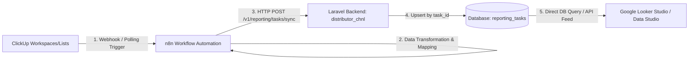

# Dokumentasi Integrasi ClickUp ➔ n8n ➔ Database Laravel ➔ Google Looker Studio (Data Studio)

Dokumen ini menjelaskan arsitektur, skema tabel, dan spesifikasi API untuk alur integrasi pelaporan tugas (*task reporting & analytics*) dari **ClickUp** menuju **Google Looker Studio (Data Studio)** melalui **n8n workflow automation** dan **Database Backend Laravel**.

---

## 1. Arsitektur Alur Integrasi (End-to-End Workflow)



### Penjelasan Tahapan:
1. **ClickUp:** Sumber data task operasional, sprint, developer workload, deadline, dan status pengerjaan.
2. **n8n Automation:**
   * Menerima event trigger (contoh: *Task Created*, *Task Updated*, *Status Changed*, atau *Schedule Polling* berkala).
   * Melakukan normalisasi format (konversi unix timestamp ms ke format `YYYY-MM-DD HH:mm:ss`, mapping nama assignee, prioritas, dan comment).
   * Mengirimkan payload JSON ke API endpoint Laravel Backend.
3. **Laravel Backend (`distributor_chnl`):**
   * Endpoint `POST /api/distributor-channel/v1/reporting/tasks/sync` menerima data task (bisa single object ataupun batch array).
   * Menjalankan operasi **`updateOrCreate` (Upsert)** berdasarkan kolom `task_id` yang unik.
   * Mencatat `synced_at = now()`.
4. **Database (`reporting_tasks`):**
   * Menampung data historis & teraktual secara terstruktur dan bersih (*clean structured data*).
5. **Google Looker Studio (Data Studio):**
   * Terhubung langsung ke Database PostgreSQL/MySQL atau melalui REST API JSON connector untuk visualisasi dashboard (Burndown Chart, Task by Assignee, Overdue Tasks, Velocity, dsb.).

---

## 2. Struktur Skema Tabel Database

### Nama Tabel: `reporting_tasks`

```sql
CREATE TABLE reporting_tasks (
    id BIGINT UNSIGNED AUTO_INCREMENT PRIMARY KEY,

    task_id VARCHAR(100) NOT NULL,
    task_name VARCHAR(255) NULL,

    space_name VARCHAR(255) NULL,
    folder_name VARCHAR(255) NULL,
    list_name VARCHAR(255) NULL,

    assignee VARCHAR(255) NULL,

    timeline VARCHAR(100) NULL,
    start_date DATETIME NULL,
    due_date DATETIME NULL,

    priority VARCHAR(50) NULL,

    task_type VARCHAR(100) NULL,

    created_by VARCHAR(255) NULL,

    comment TEXT NULL,

    status VARCHAR(100) NULL,

    synced_at DATETIME NULL,
    created_at DATETIME NULL,
    updated_at DATETIME NULL,

    UNIQUE KEY uq_task_id (task_id)
);
```

### Rincian Kolom:
| Kolom | Tipe Data | Keterangan |
| :--- | :--- | :--- |
| `id` | `BIGINT` (PK) | Auto increment identifier lokal |
| `task_id` | `VARCHAR(100)` (Unique) | ID Task dari ClickUp (contoh: `8678abc123`) |
| `task_name` | `VARCHAR(255)` | Judul / nama task di ClickUp |
| `space_name` | `VARCHAR(255)` | Nama Space di ClickUp (contoh: `Engineering`) |
| `folder_name` | `VARCHAR(255)` | Nama Folder di ClickUp (contoh: `Backend Services`) |
| `list_name` | `VARCHAR(255)` | Nama List di ClickUp (contoh: `Sprint 3 Backlog`) |
| `assignee` | `VARCHAR(255)` | Nama / email PIC penanggung jawab task |
| `timeline` | `VARCHAR(100)` | Label waktu/sprint (contoh: `Sprint 1`, `Q3 2026`) |
| `start_date` | `DATETIME` | Tanggal & jam mulai pengerjaan |
| `due_date` | `DATETIME` | Tanggal & jam tenggat waktu (deadline) |
| `priority` | `VARCHAR(50)` | Tingkat prioritas (`urgent`, `high`, `normal`, `low`) |
| `task_type` | `VARCHAR(100)` | Kategori task (contoh: `Feature`, `Bug`, `Task`, `Doc`) |
| `created_by` | `VARCHAR(255)` | User pembuat task di ClickUp |
| `comment` | `TEXT` | Komentar terakhir / deskripsi ringkas task |
| `status` | `VARCHAR(100)` | Status task di ClickUp (`to do`, `in progress`, `review`, `complete`) |
| `synced_at` | `DATETIME` | Waktu data disinkronkan dari n8n |
| `created_at` | `DATETIME` | Waktu baris pertama kali dibuat di database lokal |
| `updated_at` | `DATETIME` | Waktu baris terakhir diupdate |

---

## 3. Spesifikasi Endpoint API Backend

Base URL API: `/api/distributor-channel/v1/reporting`

---

### A. Sync Task dari n8n (Webhook Ingestion)

Menerima data task tunggal atau kumpulan task (*batch array*) dari n8n untuk disimpan / diupdate (*upsert*) ke tabel `reporting_tasks`.

* **Method:** `POST`
* **URL:** `/api/distributor-channel/v1/reporting/tasks/sync` *(atau `/v1/reporting/clickup-tasks/sync`)*
* **Headers:**
  ```http
  Content-Type: application/json
  ```

#### 1) Contoh Request Body (Single Task):
```json
{
  "task_id": "8678abc123",
  "task_name": "Develop Production Module & SAP Integration",
  "space_name": "Engineering",
  "folder_name": "Backend Services",
  "list_name": "Sprint 3 Backlog",
  "assignee": "Sanjay Firmansyah",
  "timeline": "Sprint 3",
  "start_date": "2026-08-19 08:00:00",
  "due_date": "2026-08-25 17:00:00",
  "priority": "high",
  "task_type": "Feature",
  "created_by": "Product Manager",
  "comment": "Tabel PDO lokal sudah dibuat dan siap integrasi SAP.",
  "status": "in progress"
}
```

#### 2) Contoh Request Body (Batch Array dari n8n):
```json
{
  "tasks": [
    {
      "task_id": "8678abc123",
      "task_name": "Develop Production Module & SAP Integration",
      "space_name": "Engineering",
      "folder_name": "Backend Services",
      "list_name": "Sprint 3 Backlog",
      "assignee": "Sanjay Firmansyah",
      "timeline": "Sprint 3",
      "start_date": 1787043600000,
      "due_date": 1787590800000,
      "priority": "high",
      "task_type": "Feature",
      "created_by": "PM",
      "comment": "Progress 80%",
      "status": "in progress"
    },
    {
      "task_id": "8678abc124",
      "task_name": "Fix RBAC Permission Matrix Bug",
      "space_name": "Engineering",
      "folder_name": "Backend Services",
      "list_name": "Sprint 3 Backlog",
      "assignee": "Budi Santoso",
      "timeline": "Sprint 3",
      "start_date": "2026-08-18 09:00:00",
      "due_date": "2026-08-19 18:00:00",
      "priority": "urgent",
      "task_type": "Bug",
      "created_by": "QA Tester",
      "comment": "Resolved and tested on staging.",
      "status": "complete"
    }
  ]
}
```

* **Response Success (200 OK):**
```json
{
  "success": true,
  "status_code": 200,
  "message": "Data task ClickUp berhasil disinkronkan ke database reporting.",
  "data": {
    "total": 2,
    "success": 2,
    "failed": 0,
    "errors": []
  }
}
```

---

### B. Get List Reporting Tasks (Untuk Data Studio / BI Feed)

Mengambil data tasks dengan berbagai filter dan opsi paginasi atau full data.

* **Method:** `GET`
* **URL:** `/api/distributor-channel/v1/reporting/tasks`
* **Query Parameters (Opsional):**
  * `search`: Pencarian nama task, task ID, atau assignee.
  * `status`: Filter status (e.g. `complete`, `in progress`).
  * `assignee`: Filter nama PIC.
  * `priority`: Filter prioritas (`urgent`, `high`, `normal`, `low`).
  * `task_type`: Filter tipe task.
  * `timeline`: Filter sprint / timeline.
  * `start_date_from` / `start_date_to`: Filter rentang start date.
  * `due_date_from` / `due_date_to`: Filter rentang deadline.
  * `all=true`: Mengambil seluruh baris tanpa paginasi (sangat ideal untuk Looker Studio REST Connector).
* **Response Success (200 OK):**
```json
{
  "success": true,
  "status_code": 200,
  "message": "Daftar reporting tasks berhasil diambil.",
  "data": {
    "current_page": 1,
    "data": [
      {
        "id": 1,
        "task_id": "8678abc123",
        "task_name": "Develop Production Module & SAP Integration",
        "assignee": "Sanjay Firmansyah",
        "timeline": "Sprint 3",
        "start_date": "2026-08-19T08:00:00.000000Z",
        "due_date": "2026-08-25T17:00:00.000000Z",
        "priority": "high",
        "task_type": "Feature",
        "created_by": "Product Manager",
        "comment": "Tabel PDO lokal sudah dibuat dan siap integrasi SAP.",
        "status": "in progress",
        "synced_at": "2026-08-19T11:42:00.000000Z",
        "created_at": "2026-08-19T11:42:00.000000Z",
        "updated_at": "2026-08-19T11:42:00.000000Z"
      }
    ],
    "total": 1
  }
}
```

---

### C. Get Summary Metrik (Dashboard Analytics)

Menghitung statistik instan untuk ringkasan di Looker Studio / Dashboard internal.

* **Method:** `GET`
* **URL:** `/api/distributor-channel/v1/reporting/tasks/summary`
* **Response Success (200 OK):**
```json
{
  "success": true,
  "status_code": 200,
  "message": "Summary reporting tasks berhasil diambil.",
  "data": {
    "total_tasks": 45,
    "overdue_tasks": 3,
    "by_status": {
      "to do": 10,
      "in progress": 15,
      "in review": 5,
      "complete": 15
    },
    "by_priority": {
      "urgent": 4,
      "high": 12,
      "normal": 25,
      "low": 4
    },
    "top_assignees": {
      "Sanjay Firmansyah": 18,
      "Budi Santoso": 12,
      "Dewi Lestari": 15
    },
    "last_synced_at": "2026-08-19 11:42:00"
  }
}
```

---

## 4. Panduan Konfigurasi Node n8n

Di n8n Workflow:
1. **Trigger Node:** *ClickUp Trigger* (Event: `Task Created`, `Task Updated`, atau *Schedule Trigger* setiap 15 menit).
2. **Function / Code Node (Optional):** Normalisasi field jika payload mentah ClickUp bersarang (*nested*).
   ```javascript
   return items.map(item => {
     const task = item.json;
     return {
       json: {
         task_id: task.id,
         task_name: task.name,
         space_name: task.space?.name || task.space_name || null,
         folder_name: task.folder?.name || task.folder_name || null,
         list_name: task.list?.name || task.list_name || null,
         assignee: task.assignees ? task.assignees.map(a => a.username || a.name || a.email).join(', ') : null,
         timeline: task.custom_fields?.find(f => f.name === 'Sprint')?.value || task.timeline || null,
         start_date: task.start_date ? Number(task.start_date) : null,
         due_date: task.due_date ? Number(task.due_date) : null,
         priority: task.priority ? (task.priority.priority || task.priority.name) : 'normal',
         task_type: task.custom_fields?.find(f => f.name === 'Type')?.value || task.task_type || 'Task',
         created_by: task.creator ? (task.creator.username || task.creator.name) : null,
         comment: task.text_content || task.description || '',
         status: task.status ? (task.status.status || task.status.name) : 'to do'
       }
     };
   });
   ```
3. **HTTP Request Node:**
   * **Method:** `POST`
   * **URL:** `http://<domain-backend>/api/distributor-channel/v1/reporting/tasks/sync`
   * **Body Content Type:** `JSON`
   * **Specify Body:** `Using Fields Below` atau `JSON`

---

## 5. Panduan Koneksi ke Google Looker Studio (Data Studio)

Ada 2 cara menghubungkan Looker Studio ke tabel `reporting_tasks`:

1. **Cara 1: Konektor Database Langsung (Direkomendasikan)**
   * Pilih konektor bawaan Looker Studio: **PostgreSQL** atau **MySQL**.
   * Masukkan Host, Port, Database Name, Username, dan Password database Laravel.
   * Pilih tabel `reporting_tasks` atau buat Custom SQL Query.
2. **Cara 2: REST API JSON Connector (Community Connector)**
   * Masukkan URL endpoint: `http://<domain-backend>/api/distributor-channel/v1/reporting/tasks?all=true`.
