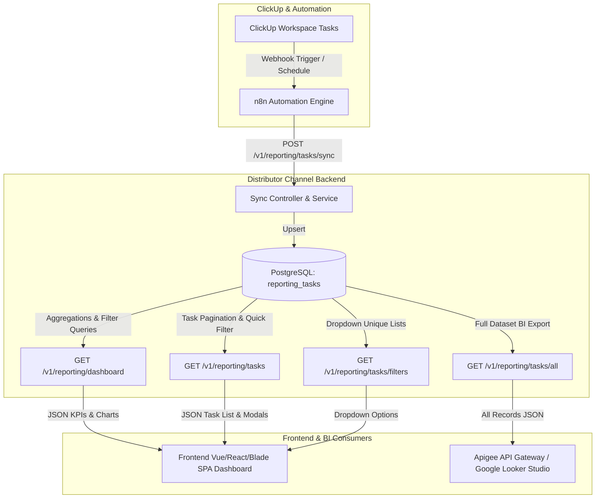

# ClickUp Task Monitoring & Reporting Dashboard API Guide

Dokumentasi ini menjelaskan arsitektur, spesifikasi endpoint REST API, alur integrasi webhook n8n/ClickUp, dan panduan integrasi untuk **Tim Frontend (FE)**, **Google Looker Studio**, dan **Apigee API Gateway**.

---

## 1. Arsitektur & Alur Data (Mermaid Diagram)



---

## 2. Struktur Database (`reporting_tasks`)

Tabel `reporting_tasks` menyimpan replika task ClickUp yang disinkronkan:

| Kolom | Tipe | Keterangan |
| :--- | :--- | :--- |
| `id` | `BIGSERIAL` (PK) | Primary Key Auto Increment |
| `task_id` | `VARCHAR(100)` (Unique, Index) | ID Task unik dari ClickUp (e.g. `86b2x9z10`) |
| `task_name` | `VARCHAR(255)` (Index) | Nama / Judul Task |
| `space_id` | `VARCHAR(100)` (Index) | ID Space ClickUp |
| `space_name` | `VARCHAR(255)` | Nama Space ClickUp |
| `folder_name` | `VARCHAR(255)` | Nama Folder |
| `list_name` | `VARCHAR(255)` (Index) | Nama List ClickUp |
| `assignee` | `VARCHAR(255)` (Index) | Nama Assignee (bisa string gabungan jika multiple) |
| `timeline` | `VARCHAR(100)` | Sprint / Timeline |
| `start_date` | `TIMESTAMP` | Tanggal mulai task |
| `due_date` | `TIMESTAMP` (Index) | Tanggal deadline / jatuh tempo |
| `priority` | `VARCHAR(50)` (Index) | `urgent`, `high`, `normal`, `low`, `none` |
| `task_type` | `VARCHAR(100)` | Tipe task |
| `created_by` | `VARCHAR(255)` | Pembuat task |
| `comment` | `TEXT` | Deskripsi / Catatan task |
| `status` | `VARCHAR(100)` (Index) | Status task (e.g. `to do`, `in progress`, `complete`) |
| `synced_at` | `TIMESTAMP` | Waktu terakhir disinkronkan dari n8n |
| `created_at` / `updated_at` | `TIMESTAMP` | Timestamps Laravel |

---

## 3. Autentikasi API

Endpoint dapat diakses menggunakan salah satu metode berikut:
1. **User Login (Frontend SPA):**
   * Header: `Authorization: Bearer <Sanctum_JWT_Token>`
2. **API Key / Secret Token (Apigee / Looker Studio / n8n):**
   * Header: `X-API-Key: <REPORTING_API_KEY>`
   * Atau Header: `X-Apigee-Secret: <REPORTING_API_KEY>`
   * Atau Header: `Authorization: Bearer <REPORTING_API_KEY>`
   * Atau Query: `?api_key=<REPORTING_API_KEY>`

---

## 4. Spesifikasi API Endpoint untuk Tim Frontend

### A. GET Dashboard Data (KPIs, Charts, Options)

Mengambil ringkasan metrik statistik KPI, data chart, opsi filter dropdown, dan waktu sinkronisasi terakhir sekaligus dalam satu panggilan API.

* **Method:** `GET`
* **URL:** `/api/distributor-channel/v1/reporting/dashboard`
* **Query Parameters (Opsional):**
  * `search` : string
  * `space_id` : string
  * `folder_name` : string
  * `list_name` : string
  * `status` : string
  * `assignee` : string
  * `priority` : string
  * `start_date_from` : `YYYY-MM-DD`
  * `due_date_to` : `YYYY-MM-DD`

* **Response Success (200 OK):**
```json
{
  "success": true,
  "status_code": 200,
  "message": "Data dashboard monitoring ClickUp berhasil diambil.",
  "data": {
    "kpis": {
      "total_tasks": 128,
      "in_progress": 42,
      "completed": 64,
      "overdue": 12,
      "due_soon": 10,
      "completion_rate": 50.0
    },
    "charts": {
      "status_distribution": [
        { "label": "Complete", "total": 64 },
        { "label": "In Progress", "total": 35 },
        { "label": "In Review", "total": 7 },
        { "label": "To Do", "total": 22 }
      ],
      "priority_distribution": [
        { "label": "urgent", "total": 15 },
        { "label": "high", "total": 30 },
        { "label": "normal", "total": 60 },
        { "label": "low", "total": 23 }
      ],
      "top_assignees": [
        { "label": "Budi Santoso", "total": 34 },
        { "label": "Siti Rahma", "total": 28 },
        { "label": "Ahmad Fauzi", "total": 22 }
      ],
      "list_distribution": [
        { "label": "Sprint 24", "total": 50 },
        { "label": "Backlog", "total": 45 },
        { "label": "Bug Fixes", "total": 33 }
      ],
      "due_date_timeline": [
        { "label": "2026-08-20", "total": 5 },
        { "label": "2026-08-21", "total": 8 },
        { "label": "2026-08-22", "total": 14 }
      ]
    },
    "filter_options": {
      "spaces": [
        { "space_id": "90180234", "space_name": "Engineering & IT" }
      ],
      "folders": ["Core System", "Mobile App"],
      "lists": ["Sprint 24", "Backlog", "Bug Fixes"],
      "assignees": ["Ahmad Fauzi", "Budi Santoso", "Siti Rahma"],
      "statuses": ["to do", "in progress", "in review", "complete"],
      "priorities": ["urgent", "high", "normal", "low"]
    },
    "last_synced_at": "2026-08-22 09:15:00"
  }
}
```

---

### B. GET List Tasks (Paginated & Filterable)

Mengambil daftar tabel task dengan paginasi, pencarian full-text, pengurutan, dan quick filter KPI.

* **Method:** `GET`
* **URL:** `/api/distributor-channel/v1/reporting/tasks`
* **Query Parameters:**
  * `page` (int, default: 1): Nomor halaman
  * `per_page` (int, default: 15 / 50): Jumlah per halaman
  * `search` (string): Pencarian kata kunci (nama task, task ID, space, list, assignee, komentar)
  * `quick_filter` (string):
    * `in_progress` : Filter task sedang berjalan / in review
    * `completed` : Filter task yang sudah selesai / closed
    * `overdue` : Filter task yang telat (due date < hari ini & belum selesai)
    * `due_soon` : Filter task jatuh tempo dalam 7 hari ke depan
  * `space_id` (string): Filter ID Space ClickUp
  * `folder_name` (string): Filter nama folder
  * `list_name` (string): Filter nama list
  * `status` (string): Filter status tertentu
  * `assignee` (string): Filter nama assignee
  * `priority` (string): `urgent`, `high`, `normal`, `low`
  * `start_date_from` (YYYY-MM-DD): Tanggal mulai
  * `start_date_to` (YYYY-MM-DD): Tanggal mulai batas atas
  * `due_date_from` (YYYY-MM-DD): Tanggal deadline
  * `due_date_to` (YYYY-MM-DD): Tanggal deadline batas atas
  * `sort_by` (string, default: `updated_at`): `task_name`, `status`, `priority`, `assignee`, `list_name`, `start_date`, `due_date`, `updated_at`, `synced_at`
  * `sort_order` (string, default: `desc`): `asc` atau `desc`

* **Response Success (200 OK):**
```json
{
  "success": true,
  "status_code": 200,
  "message": "Daftar reporting tasks berhasil diambil.",
  "data": {
    "current_page": 1,
    "data": [
      {
        "id": 1,
        "task_id": "86b2x9z10",
        "task_name": "Implementasi Modul Produksi SAP Sync",
        "space_id": "90180234",
        "space_name": "Engineering & IT",
        "folder_name": "Distributor Channel",
        "list_name": "Sprint 24",
        "assignee": "Budi Santoso",
        "timeline": "Sprint 24",
        "start_date": "2026-08-15 08:00:00",
        "due_date": "2026-08-25 17:00:00",
        "priority": "high",
        "task_type": "Task",
        "created_by": "Manager IT",
        "comment": "Integrasi endpoint getReceiptProdbyId",
        "status": "in progress",
        "synced_at": "2026-08-22 09:15:00",
        "created_at": "2026-08-15 08:00:00",
        "updated_at": "2026-08-22 09:15:00"
      }
    ],
    "first_page_url": "https://api-dev.susantimegah.com/api/distributor-channel/v1/reporting/tasks?page=1",
    "from": 1,
    "last_page": 9,
    "last_page_url": "https://api-dev.susantimegah.com/api/distributor-channel/v1/reporting/tasks?page=9",
    "next_page_url": "https://api-dev.susantimegah.com/api/distributor-channel/v1/reporting/tasks?page=2",
    "path": "https://api-dev.susantimegah.com/api/distributor-channel/v1/reporting/tasks",
    "per_page": 15,
    "prev_page_url": null,
    "to": 15,
    "total": 128
  }
}
```

---

### C. GET Filter Dropdown Options

* **Method:** `GET`
* **URL:** `/api/distributor-channel/v1/reporting/tasks/filters` *(atau `/filter-options`)*
* **Response Success (200 OK):**
```json
{
  "success": true,
  "status_code": 200,
  "message": "Daftar opsi filter reporting berhasil diambil.",
  "data": {
    "spaces": [
      { "space_id": "90180234", "space_name": "Engineering & IT" }
    ],
    "folders": ["Core System", "Mobile App"],
    "lists": ["Sprint 24", "Backlog", "Bug Fixes"],
    "assignees": ["Ahmad Fauzi", "Budi Santoso", "Siti Rahma"],
    "statuses": ["to do", "in progress", "in review", "complete"],
    "priorities": ["urgent", "high", "normal", "low"]
  }
}
```

---

### D. GET Detail Task

* **Method:** `GET`
* **URL:** `/api/distributor-channel/v1/reporting/tasks/{id}` *(bisa menggunakan auto-increment `id` atau ClickUp `task_id`)*
* **Response Success (200 OK):**
```json
{
  "success": true,
  "status_code": 200,
  "message": "Detail reporting task berhasil diambil.",
  "data": {
    "id": 1,
    "task_id": "86b2x9z10",
    "task_name": "Implementasi Modul Produksi SAP Sync",
    "space_id": "90180234",
    "space_name": "Engineering & IT",
    "folder_name": "Distributor Channel",
    "list_name": "Sprint 24",
    "assignee": "Budi Santoso",
    "timeline": "Sprint 24",
    "start_date": "2026-08-15 08:00:00",
    "due_date": "2026-08-25 17:00:00",
    "priority": "high",
    "task_type": "Task",
    "created_by": "Manager IT",
    "comment": "Integrasi endpoint getReceiptProdbyId",
    "status": "in progress",
    "synced_at": "2026-08-22 09:15:00"
  }
}
```

---

### E. GET All Tasks for Looker Studio / Apigee (Unpaginated)

* **Method:** `GET`
* **URL:** `/api/distributor-channel/v1/reporting/tasks/all`
* **Response Success (200 OK):** Mengembalikan array data utuh tanpa dibatasi halaman.

---

### F. POST Sync Tasks (Webhook n8n / ClickUp)

* **Method:** `POST`
* **URL:** `/api/distributor-channel/v1/reporting/tasks/sync`
* **Request Body (JSON):** Mendukung single object, array of objects, atau `{ "tasks": [...] }`.
```json
{
  "tasks": [
    {
      "task_id": "86b2x9z10",
      "task_name": "Implementasi Modul Produksi SAP Sync",
      "space": { "id": "90180234", "name": "Engineering & IT" },
      "folder": { "name": "Distributor Channel" },
      "list": { "name": "Sprint 24" },
      "assignees": [{ "username": "Budi Santoso" }],
      "priority": { "priority": "high" },
      "status": { "status": "in progress" },
      "start_date": 1755244800000,
      "due_date": 1756141200000
    }
  ]
}
```
