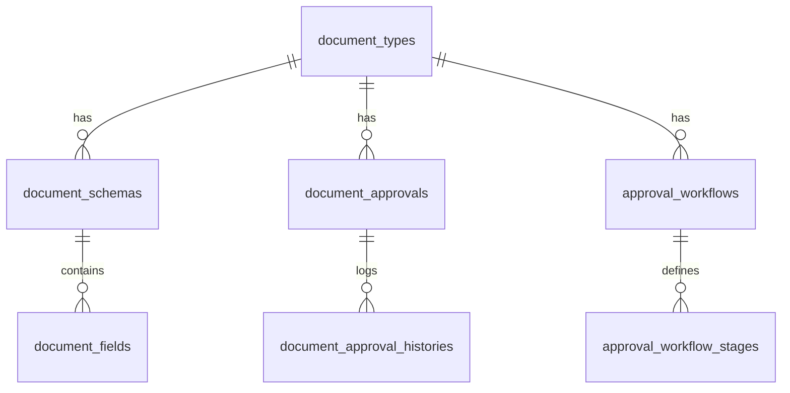

# Dynamic Document Approval System — SAP Business One

Dokumentasi arsitektur, database, engine rendering dinamis, serta integrasi API untuk modul persetujuan (*approval*) dokumen SAP Business One berbasis Laravel dan Frontend dinamis.

---

## 1. Ringkasan & Tujuan Sistem

Sistem ini dirancang untuk menangani berbagai macam **Document Type SAP Business One** (seperti Purchase Request, Purchase Order, Goods Receipt PO, A/P Invoice, Sales Order, dll) menggunakan arsitektur generic berbasis konfigurasi database (*schema-driven*).

### Keuntungan Utama:
1. **Frontend Dinamis:** Frontend tidak perlu membuat komponen tampilan berbeda atau mengetahui nama tabel/kolom SAP. Cukup me-render metadata JSON dari Backend.
2. **Extensible:** Penambahan Document Type baru **tidak memerlukan perubahan kode Controller, Engine, ataupun Frontend**.
3. **Auditable:** Dilengkapi dengan **Approval History (Audit Trail)** multi-level yang merekam siapa yang menyetujui/menolak, catatan, tanggal aksi, dan level approval.
4. **Aman & Cepat:** Value calculation tanpa `eval()` berbahaya, dan lookup resolver siap menangani *batch loading* untuk mencegah *N+1 query issue*.

---

## 2. Target Arsitektur & Design Patterns

```text
                           SAP BUSINESS ONE
                                  │
                                  ▼
                      Document Adapter Factory
                                  │
                                  ▼
                        Document Adapter (PR / PO / GRPO)
                                  │
                                  ▼
                        Approval Detail Service
                                  │
                   ┌──────────────┼──────────────┐
                   ▼              ▼              ▼
            Document Schema    Value Engine   Audit History
                   │              │              │
                   └──────────────┼──────────────┘
                                  ▼
                          Document Renderer
                                  │
                                  ▼
                        Normalized Response DTO
                                  │
                                  ▼
                             Frontend (FE)
```

### Prinsip Layer:
* **SAP B1:** *Source of Truth* transaksi bisnis & master data.
* **Adapter Pattern (`DocumentAdapterInterface`):** Mengabstraksi perbedaan struktur data antar dokumen SAP.
* **Strategy / Resolver Pattern (`ValueResolverInterface`):** Menyelesaikan nilai data (*direct*, *lookup*, *calculated*, *static*).
* **Renderer Service (`DocumentRenderer`):** Menggabungkan skema database dengan data mentah SAP menjadi response JSON terstruktur.
* **State & History Engine (`ApprovalActionService`):** Mengelola mutasi status (`PENDING`, `APPROVED`, `REJECTED`, `REVISED`) dengan transaksi database dan log riwayat.

---

## 3. Struktur Database (Schema & Relasi)



### Penjelasan Tabel:
1. **`document_types`**: Master dokumen SAP (PR, PO, GRPO, dll) beserta `sap_object_type`, `header_source` (OPOR, OPRQ), dan `line_source` (POR1, PRQ1).
2. **`document_schemas`**: Menyimpan versi skema aktif dan konfigurasi layout/tabs global.
3. **`document_fields`**: Definisi field per bagian (`header`, `line`, `summary`, `logistics`, `accounting`).
4. **`document_approvals`**: Header data transaksi persetujuan di aplikasi web.
5. **`document_approval_histories`**: Log kronologi persetujuan (*Audit Trail*), memuat `user_id`, `level`, `stage_name`, `action` (APPROVE/REJECT/REVISE), dan `notes`.
6. **`approval_workflows` & `approval_workflow_stages`**: Konfigurasi batasan nominal (*amount limit*) dan penanggung jawab persetujuan per stage.

---

## 4. Tipe Resolusi Nilai (*Source Types*)

Setiap field pada dokumen didefinisikan menggunakan salah satu dari 4 `source_type`:

### 1. `direct`
Mengambil nilai langsung dari atribut dokumen SAP.
* *Contoh Config:* `source: "OPOR.DocNum"`, `field_type: "text"`
* *Formatter didukung:* `currency`, `number`, `date`, `datetime`, `boolean`.

### 2. `lookup`
Digunakan jika dokumen hanya menyimpan kode/ID (misal `CardCode`, `ItemCode`, `WhsCode`) namun UI membutuhkan nama lengkap.
* *Contoh Config:*
  ```json
  {
    "source_type": "lookup",
    "source": "CardCode",
    "lookup_config": {
      "type": "business_partner",
      "table": "OCRD",
      "key_field": "CardCode",
      "display_field": "CardName"
    }
  }
  ```
* *Resolvers Tersedia:* `BusinessPartnerLookupResolver` (OCRD), `ItemLookupResolver` (OITM), `WarehouseLookupResolver` (OWHS), `UserLookupResolver` (OUSR/Users).

### 3. `calculated`
Melakukan kalkulasi matematika secara aman tanpa `eval()`.
* *Contoh Config:*
  ```json
  {
    "source_type": "calculated",
    "calculation_config": {
      "expression": "Quantity * Price"
    },
    "formatter_config": {
      "currency": "Rp",
      "decimals": 0
    }
  }
  ```

### 4. `static`
Menampilkan nilai statis/konstanta.
* *Contoh Config:* `source: "PT Susanti Megah"`, `source_type: "static"`.

---

## 5. Dokumentasi API Endpoint

Base URL Prefix: `/api/distributor-channel/v1/document-approval`

### 1. List Dokumen Approval
Mengambil daftar pengajuan dokumen persetujuan.

* **Endpoint:** `GET /approvals`
* **Query Parameters:**
  * `status` *(opsional)*: `PENDING`, `APPROVED`, `REJECTED`, `REVISED`
  * `type_code` *(opsional)*: `PO`, `PR`, `GRPO`
  * `search` *(opsional)*: Mencari berdasarkan nomor dokumen SAP atau nama pemohon
  * `per_page` *(opsional)*: Default 15
* **Response Contoh:**
  ```json
  {
    "success": true,
    "message": "Approvals retrieved successfully",
    "data": [
      {
        "id": 1,
        "sap_doc_num": "PO-50001",
        "sap_object_type": 22,
        "status": "PENDING",
        "current_level": 2,
        "max_level": 3,
        "doc_date": "2026-08-16",
        "total_amount": "138750000.0000",
        "currency": "IDR",
        "requester_name": "Purchasing Officer Balaraja",
        "document_type": {
          "code": "PO",
          "name": "Purchase Order"
        }
      }
    ],
    "pagination": {
      "current_page": 1,
      "last_page": 1,
      "per_page": 15,
      "total": 1
    }
  }
  ```

---

### 2. Detail Dokumen Dinamis (Siap Render di FE)
Mengambil detail dokumen lengkap yang telah digabungkan dengan skema dan histori persetujuan.

* **Endpoint:** `GET /approvals/{id}`
* **Response Contoh:**
  ```json
  {
    "success": true,
    "message": "Document detail rendered successfully",
    "data": {
      "approval": {
        "id": 1,
        "status": "PENDING",
        "currentLevel": 2,
        "maxLevel": 3,
        "requester": {
          "id": 2,
          "name": "Purchasing Officer Balaraja"
        },
        "submittedAt": "2026-08-16 09:15:00",
        "approvedAt": null,
        "rejectedAt": null
      },
      "document": {
        "typeCode": "PO",
        "typeName": "Purchase Order",
        "sapObjectType": 22,
        "docEntry": 5001,
        "docNum": "PO-50001",
        "currency": "IDR"
      },
      "layout": {
        "tabs": [
          { "id": "general", "label": "Informasi Utama" },
          { "id": "logistics", "label": "Logistik & Alamat" }
        ]
      },
      "header": [
        {
          "field": "DocNum",
          "label": "No. PO SAP",
          "type": "text",
          "value": "PO-50001",
          "displayValue": "PO-50001",
          "readonly": true,
          "required": false,
          "ui": { "tab": "general", "col_span": 4 }
        },
        {
          "field": "DocDate",
          "label": "Tanggal Dokumen",
          "type": "date",
          "value": "2026-08-18",
          "displayValue": "18 Aug 2026",
          "readonly": true,
          "required": false,
          "ui": { "tab": "general", "col_span": 4 }
        },
        {
          "field": "CardCode",
          "label": "Supplier / Vendor",
          "type": "lookup",
          "value": "V-0012",
          "displayValue": "PT Aneka Kimia Raya Sejahtera",
          "readonly": true,
          "required": false,
          "ui": { "tab": "general", "col_span": 6 }
        }
      ],
      "lines": {
        "columns": [
          { "field": "LineNum", "label": "#", "type": "number", "align": "center", "width": "50px" },
          { "field": "ItemCode", "label": "Kode Barang", "type": "lookup", "align": "left", "width": "140px" },
          { "field": "ItemDescription", "label": "Deskripsi Barang", "type": "text", "align": "left", "width": "auto" },
          { "field": "Quantity", "label": "Kuantitas", "type": "number", "align": "right", "width": "90px" },
          { "field": "Price", "label": "Harga Satuan", "type": "currency", "align": "right", "width": "140px" },
          { "field": "LineTotal", "label": "Total Harga", "type": "currency", "align": "right", "width": "150px" },
          { "field": "WhsCode", "label": "Gudang", "type": "lookup", "align": "center", "width": "110px" }
        ],
        "data": [
          {
            "LineNum": { "value": 0, "displayValue": "0" },
            "ItemCode": { "value": "RM-SALT-RAW", "displayValue": "RM-SALT-RAW" },
            "ItemDescription": { "value": "Garam Kasar (Raw Solar Salt)", "displayValue": "Garam Kasar (Raw Solar Salt)" },
            "Quantity": { "value": 100, "displayValue": "100" },
            "Price": { "value": 1250000, "displayValue": "Rp 1.250.000" },
            "LineTotal": { "value": 125000000, "displayValue": "Rp 125.000.000" },
            "WhsCode": { "value": "WHS-BLR", "displayValue": "Gudang (WHS-BLR)" }
          }
        ],
        "totalRows": 1
      },
      "summary": [
        {
          "field": "SubTotal",
          "label": "Subtotal",
          "type": "currency",
          "value": 125000000,
          "displayValue": "Rp 125.000.000",
          "ui": []
        },
        {
          "field": "VatSum",
          "label": "PPN (11%)",
          "type": "currency",
          "value": 13750000,
          "displayValue": "Rp 13.750.000",
          "ui": []
        },
        {
          "field": "DocTotal",
          "label": "Grand Total PO",
          "type": "currency",
          "value": 138750000,
          "displayValue": "Rp 138.750.000",
          "ui": { "is_highlight": true }
        }
      ],
      "approvalHistory": [
        {
          "id": 1,
          "level": 1,
          "stageName": "Submission",
          "action": "SUBMIT",
          "userName": "Purchasing Officer Balaraja",
          "userRole": "Purchasing Staff",
          "notes": "Pengajuan PO untuk supplier PT Aneka Kimia Raya Sejahtera",
          "actionAt": "2026-08-16 09:15:00"
        },
        {
          "id": 2,
          "level": 1,
          "stageName": "Review Spv Purchasing",
          "action": "APPROVE",
          "userName": "Supervisor Purchasing",
          "userRole": "Spv Purchasing",
          "notes": "Spesifikasi teknis & kuota supplier sudah sesuai kuota Q3",
          "actionAt": "2026-08-17 14:30:00"
        }
      ]
    }
  }
  ```

---

### 3. Aksi Persetujuan Dokumen

#### Approve Dokumen
* **Endpoint:** `POST /approvals/{id}/approve`
* **Request Body:**
  ```json
  {
    "notes": "Disetujui sesuai kuota budget Q3"
  }
  ```

#### Reject Dokumen
* **Endpoint:** `POST /approvals/{id}/reject`
* **Request Body:**
  ```json
  {
    "reason": "Harga satuan melebihi batas toleransi kontrak tahunan."
  }
  ```

#### Revise / Return Dokumen
* **Endpoint:** `POST /approvals/{id}/revise`
* **Request Body:**
  ```json
  {
    "notes": "Mohon lampirkan Certificate of Analysis (COA) terbaru."
  }
  ```

---

## 6. Panduan Implementasi Frontend (FE Guide)

Frontend dapat membuat satu komponen detail generik: `DynamicApprovalDetail.vue` / `DynamicApprovalDetail.tsx`.

### 1. Render Header Fields (Grid Layout)
Gunakan `ui.col_span` untuk menentukan lebar kolom (12-column grid):
```html
<div class="grid grid-cols-12 gap-4">
  <div 
    v-for="item in response.data.header" 
    :key="item.field" 
    :class="`col-span-${item.ui?.col_span || 6}`"
  >
    <label class="text-sm text-gray-500 font-medium">{{ item.label }}</label>
    <div class="text-base font-semibold text-gray-900">{{ item.displayValue }}</div>
  </div>
</div>
```

### 2. Render Tabel Lines (Dynamic Columns)
Gunakan `lines.columns` untuk `<thead>` dan `lines.data` untuk `<tbody>`:
```html
<table class="w-full">
  <thead>
    <tr>
      <th 
        v-for="col in response.data.lines.columns" 
        :key="col.field" 
        :style="{ width: col.width, textAlign: col.align }"
      >
        {{ col.label }}
      </th>
    </tr>
  </thead>
  <tbody>
    <tr v-for="(row, idx) in response.data.lines.data" :key="idx">
      <td 
        v-for="col in response.data.lines.columns" 
        :key="col.field" 
        :style="{ textAlign: col.align }"
      >
        {{ row[col.field]?.displayValue || '-' }}
      </td>
    </tr>
  </tbody>
</table>
```

### 3. Render Approval History (Audit Trail Timeline)
```html
<div class="timeline">
  <div v-for="log in response.data.approvalHistory" :key="log.id" class="timeline-item">
    <div class="badge" :class="log.action">{{ log.action }}</div>
    <div class="font-bold">{{ log.userName }} ({{ log.userRole }})</div>
    <div class="text-sm text-gray-600">{{ log.stageName }} — {{ log.notes }}</div>
    <div class="text-xs text-gray-400">{{ log.actionAt }}</div>
  </div>
</div>
```

---

## 7. Cara Menambah Document Type Baru (Zero Backend Rewrite)

Jika di masa depan ada dokumen baru, misalnya **Sales Order (SO)** atau **Goods Return (GR_RET)**:

1. **Insert ke `document_types`:**
   ```sql
   INSERT INTO document_types (code, name, sap_object_type, module, header_source, line_source, is_active)
   VALUES ('SO', 'Sales Order', 17, 'Sales', 'ORDR', 'RDR1', 1);
   ```
2. **Insert ke `document_schemas`:**
   ```sql
   INSERT INTO document_schemas (document_type_id, version, name, is_active)
   VALUES (LAST_INSERT_ID(), 1, 'Standard Sales Order Schema', 1);
   ```
3. **Daftarkan Fields di `document_fields`:**
   Daftarkan field header (`DocNum`, `CardCode`, `DocDate`) dan lines (`ItemCode`, `Quantity`, `Price`, `LineTotal`).
4. **Buat Adapter Khusus (Jika Perlu):**
   Jika struktur data SAP berbeda, cukup buat satu file `SalesOrderAdapter.php` turunan dari `BaseSapDocumentAdapter`.

**Hasil:** Dokumen baru langsung otomatis tampil di Frontend tanpa mengubah baris kode Controller atau UI apapun!
