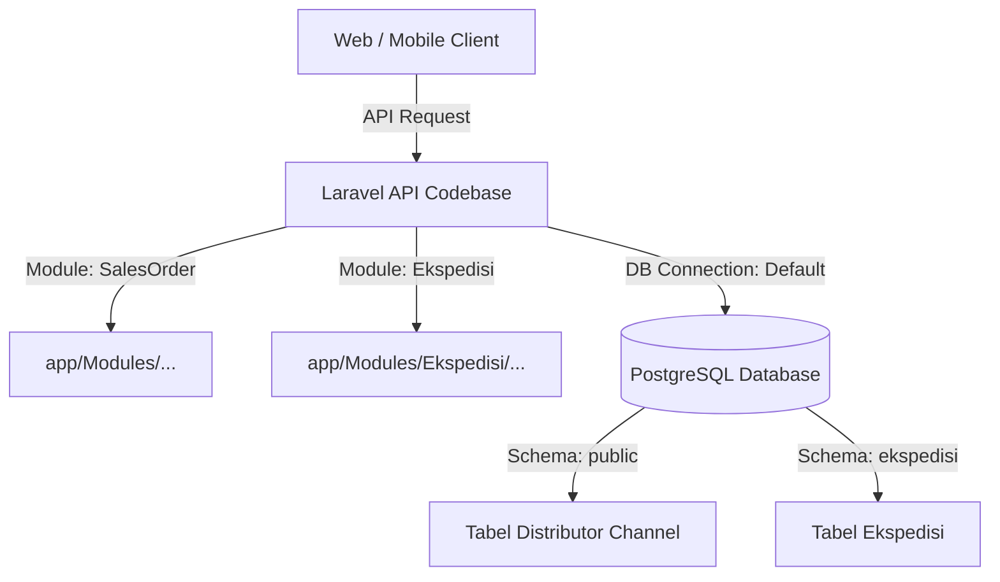

# Rancangan Kerja: Integrasi Sistem Ekspedisi (Shared API & Multi-Schema DB)

Dokumen ini menjelaskan rancangan kerja dan best practices untuk mengembangkan sistem **Ekspedisi** baru yang akan diintegrasikan ke dalam satu codebase API Laravel (`distributor_chnl`) dengan satu database PostgreSQL yang sama namun menggunakan skema terpisah (multi-schema).

---

## 1. Arsitektur Sistem

Sistem Ekspedisi akan dibangun sebagai modul baru di dalam sistem yang sudah ada dengan rancangan sebagai berikut:



---

## 2. Best Practice Pengelolaan Database (Multi-Schema PostgreSQL)

Karena database yang digunakan adalah **PostgreSQL**, memisahkan modul berdasarkan **Schema** (Skema) adalah pilihan terbaik daripada memisahkan database secara fisik. Skema default Laravel/PostgreSQL adalah `public`. Kita akan membuat skema baru bernama `ekspedisi`.

### A. Konfigurasi Database di Laravel (`config/database.php`)
Tambahkan koneksi khusus untuk skema ekspedisi di `config/database.php` agar model-model ekspedisi secara otomatis mengarah ke skema yang benar.

```php
'connections' => [
    'pgsql' => [ // Koneksi default (Skema public)
        'driver' => 'pgsql',
        'host' => env('DB_HOST', '127.0.0.1'),
        'port' => env('DB_PORT', '5432'),
        'database' => env('DB_DATABASE', 'forge'),
        'username' => env('DB_USERNAME', 'forge'),
        'password' => env('DB_PASSWORD', ''),
        'charset' => 'utf8',
        'prefix' => '',
        'search_path' => 'public', // Default ke public
        'schema' => 'public',
    ],

    'pgsql_ekspedisi' => [ // Koneksi khusus skema ekspedisi
        'driver' => 'pgsql',
        'host' => env('DB_HOST', '127.0.0.1'),
        'port' => env('DB_PORT', '5432'),
        'database' => env('DB_DATABASE', 'forge'),
        'username' => env('DB_USERNAME', 'forge'),
        'password' => env('DB_PASSWORD', ''),
        'charset' => 'utf8',
        'prefix' => '',
        'search_path' => 'ekspedisi,public', // Mencari di skema ekspedisi dulu, lalu public
        'schema' => 'ekspedisi',
    ],
],
```

### B. Pemisahan Migration
Untuk menjaga kerapian, pisahkan file migrasi skema `ekspedisi` ke dalam folder khusus:
`database/migrations/ekspedisi/`

Pada setiap file migrasi di folder tersebut, pastikan skema dibuat terlebih dahulu jika belum ada:

```php
use Illuminate\Support\Facades\Schema;
use Illuminate\Database\Schema\Blueprint;
use Illuminate\Database\Migrations\Migration;

return new class extends Migration
{
    protected $connection = 'pgsql_ekspedisi'; // Gunakan koneksi ekspedisi

    public function up()
    {
        // Pastikan skema ekspedisi dibuat di Postgres
        DB::statement('CREATE SCHEMA IF NOT EXISTS ekspedisi');

        Schema::connection($this->connection)->create('deliveries', function (Blueprint $table) {
            $table->id();
            $table->string('delivery_number')->unique();
            // Kolom relasi lintas skema ke tabel di skema public (sales_orders)
            $table->foreignId('sales_order_id')->constrained('public.sales_orders');
            $table->string('driver_name');
            $table->string('plate_number');
            $table->string('status'); // draft, shipping, delivered
            $table->timestamps();
        });
    }

    public function down()
    {
        Schema::connection($this->connection)->dropIfExists('deliveries');
    }
};
```

### C. Deklarasi Skema pada Eloquent Model
Setiap model yang masuk dalam sistem Ekspedisi harus mendefinisikan properti `$connection` dan nama tabel lengkap dengan nama skemanya:

```php
namespace App\Models;

use Illuminate\Database\Eloquent\Model;

class Delivery extends Model
{
    // Arahkan ke koneksi skema ekspedisi
    protected $connection = 'pgsql_ekspedisi';
    
    // Tulis nama tabel lengkap dengan skemanya
    protected $table = 'ekspedisi.deliveries';

    protected $fillable = [
        'delivery_number',
        'sales_order_id',
        'driver_name',
        'plate_number',
        'status',
    ];
}
```

---

## 3. Desain Database Skema `ekspedisi` (Tahap 2)

Berikut adalah struktur tabel geografi wilayah Indonesia (Provinsi, Kota, Kecamatan, Desa) dan struktur tarif ekspedisi berdasarkan rute untuk sistem pengambilan keputusan:

### A. Tabel Wilayah Geografis
Tabel ini digunakan untuk memetakan rute asal (*origin*) dan tujuan (*destination*) pengiriman.

#### 1. Tabel `provinces` (Provinsi)
*   `id` (bigint, primary key)
*   `name` (string) - Nama provinsi
*   `timestamps`

#### 2. Tabel `regencies` (Kota / Kabupaten)
*   `id` (bigint, primary key)
*   `province_id` (foreign key ke `provinces.id`)
*   `name` (string) - Nama Kota/Kabupaten
*   `timestamps`

#### 3. Tabel `districts` (Kecamatan)
*   `id` (bigint, primary key)
*   `regency_id` (foreign key ke `regencies.id`)
*   `name` (string) - Nama Kecamatan
*   `timestamps`

#### 4. Tabel `villages` (Desa / Kelurahan)
*   `id` (bigint, primary key)
*   `district_id` (foreign key ke `districts.id`)
*   `name` (string) - Nama Desa/Kelurahan
*   `timestamps`

---

### B. Tabel Master Ekspedisi & Tarif Rute

#### 5. Tabel `expeditions` (Vendor / Ekspedisi)
Tabel ini mendaftarkan daftar penyedia ekspedisi (misalnya: JNE, J&T, Sicepat, atau Armada Internal).
*   `id` (bigint, primary key)
*   `name` (string) - Nama ekspedisi
*   `code` (string, unique) - Kode ekspedisi (misal: `JNE`, `JNT`, `INTERNAL`)
*   `is_active` (boolean, default true)
*   `timestamps`

#### 6. Tabel `expedition_rates` (Tarif Ekspedisi Rute)
Tabel ini menyimpan data tarif yang ditawarkan oleh masing-masing ekspedisi berdasarkan rute spesifik dari Kota Asal (*Origin Regency*) ke Kecamatan Tujuan (*Destination District*).
*   `id` (bigint, primary key)
*   `expedition_id` (foreign key ke `expeditions.id`)
*   `origin_regency_id` (foreign key ke `regencies.id`) - Kota Asal Pengirim
*   `destination_district_id` (foreign key ke `districts.id`) - Kecamatan Tujuan Penerima
*   `rate_per_kg` (decimal, 12, 2) - Tarif per kilogram
*   `fixed_rate` (decimal, 12, 2, default 0) - Tarif dasar/flat (jika ada)
*   `estimated_days` (integer) - Estimasi pengiriman dalam hari
*   `is_active` (boolean, default true)
*   `timestamps`

---

## 4. Konsep Aktor & Hak Akses (User Roles)

Sistem ini memiliki dua aktor utama yang mengakses API terpadu:

1.  **Aktor 1: User Ekspedisi (Vendor)**
    *   **Deskripsi:** Perwakilan dari pihak ekspedisi yang diberi akses untuk mengelola data tarif rute mereka sendiri.
    *   **Hak Akses API:**
        *   Melihat daftar tarif rute milik ekspedisinya sendiri.
        *   Mengupdate tarif per kg, flat rate, dan estimasi waktu kirim (`expedition_rates`).
2.  **Aktor 2: User Pengambil Keputusan (Admin/Sales/Logistik Internal)**
    *   **Deskripsi:** User internal dari distributor channel yang bertugas memproses pengiriman sales order.
    *   **Hak Akses API:**
        *   Mencari tarif ekspedisi termurah berdasarkan rute (membandingkan dari asal ke tujuan berdasarkan berat barang).
        *   Menentukan ekspedisi mana yang akan dipakai untuk mengirim Sales Order tertentu.

---

## 5. Best Practice Struktur Codebase (Modular)

Sistem Anda sudah menerapkan arsitektur modular (`app/Modules`). Kita akan menambahkan modul baru bernama `Ekspedisi` dengan struktur berikut:

```text
app/Modules/Ekspedisi/
├── Controllers/
│   ├── DeliveryController.php       # Menangani request pengiriman barang
│   ├── TerritoryController.php      # API untuk list Provinsi/Kota/Kecamatan/Desa
│   └── RateController.php           # API pencarian tarif & pembanding termurah
├── Routes/
│   └── api.php                      # Routing API khusus Ekspedisi
├── Services/
│   ├── DeliveryService.php          # Logika pengiriman
│   └── RateComparisonService.php    # Logika pencarian tarif termurah berdasarkan rute & berat
├── Repositories/
│   ├── DeliveryRepository.php
│   └── RateRepository.php           # Query pencarian tarif terbaik
└── Requests/
    └── CompareRateRequest.php       # Validasi input rute dan berat untuk pencarian
```

Rute API di dalam `app/Modules/Ekspedisi/Routes/api.php` akan dimuat secara otomatis oleh Service Provider Anda di URL:
`/api/distributor-channel/v1/ekspedisi/...`

---

## 6. Rancangan Langkah Kerja (Roadmap Pengembangan)

Rencana kerja dibagi menjadi **5 Tahap Utama**:

| Tahap | Aktivitas | Detail Target |
|---|---|---|
| **Tahap 1** | **Persiapan & Config (SELESAI)** | 1. Tambahkan koneksi `pgsql_ekspedisi` di `config/database.php`. <br>2. Siapkan folder migrasi khusus `database/migrations/ekspedisi/`. |
| **Tahap 2** | **Desain DB & Migrasi** | 1. Buat file migrasi untuk wilayah geografis (`provinces`, `regencies`, `districts`, `villages`).<br>2. Buat file migrasi untuk master ekspedisi (`expeditions`) dan tabel tarif (`expedition_rates`). |
| **Tahap 3** | **Pembuatan Model & Repo** | 1. Buat Eloquent Model di `app/Models` dengan koneksi skema `pgsql_ekspedisi`.<br>2. Hubungkan relasi model dari skema `ekspedisi` ke skema `public` (relasi `sales_orders`). |
| **Tahap 4** | **Business Logic & API** | 1. Buat folder modul baru `app/Modules/Ekspedisi`.<br>2. Buat `RateComparisonService.php` dengan fungsi mencari ekspedisi termurah berdasarkan berat dan rute.<br>3. Daftarkan API endpoint `/rate/compare`, `/rate/update`, dan CRUD wilayah geografis. |
| **Tahap 5** | **UAT & Deployment** | 1. Uji coba pencarian tarif termurah dengan data wilayah contoh.<br>2. Deploy ke server staging/development dan jalankan migrasi skema `ekspedisi`. |

---

## 7. Sinkronisasi Data Lintas Skema (Cross-Schema Query)

Di PostgreSQL, query lintas skema sangat efisien dan tidak memerlukan koneksi jaringan baru. Anda bisa langsung melakukan `JOIN` tabel antar-skema menggunakan relasi Eloquent biasa:

```php
// Di dalam Model Delivery (Skema ekspedisi)
public function salesOrder()
{
    // Menghubungkan model Delivery (skema ekspedisi) dengan model SalesOrder (skema public)
    return $this->belongsTo(SalesOrder::class, 'sales_order_id');
}
```
Laravel akan mengeksekusi SQL JOIN secara otomatis di background:
```sql
SELECT * FROM ekspedisi.deliveries 
INNER JOIN public.sales_orders 
ON public.sales_orders.id = ekspedisi.deliveries.sales_order_id
```
Ini sangat cepat dan efisien!
