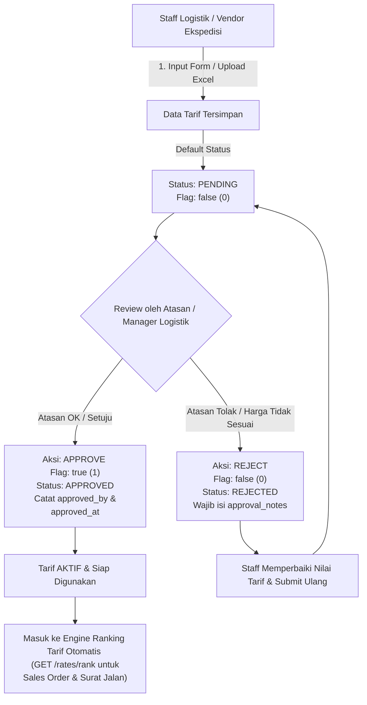

# Desain & Rencana Pengembangan Portal Ekspedisi (Multi-Schema PostgreSQL)

Dokumen ini berisi arsitektur sistem, struktur database skema `ekspedisi`, integrasi data, **alur persetujuan (*approval flag*) tarif ekspedisi oleh atasan**, dan panduan implementasi teknis.

---

## 1. Konsep Pemisahan Database Skema

Untuk menjaga performa dan isolasi data operasional pengiriman tanpa membebani tabel transaksional inti distributor, sistem menggunakan arsitektur **Multi-Schema dalam 1 Database PostgreSQL (`distributor_chnl`)**:

```text
Database: distributor_chnl (PostgreSQL)
 ├── Skema: public        -> (Tabel Inti: users, roles, sales_orders, items, distributors, dll.)
 └── Skema: ekspedisi     -> (Tabel Khusus: expeditions, expedition_rates, warehouse_origins, dll.)
```

---

## 2. Struktur Database Skema `ekspedisi`

### A. Tabel Master Ekspedisi & Tarif Rute

#### 1. Tabel `expeditions` (Vendor / Mitra Ekspedisi)
Menyimpan profil vendor ekspedisi (misal: Siba Surya, Puninar, Dakota, JNE, Armada Internal).
* `id` (bigint, primary key)
* `expedition_code` (string, unique) - Kode unik ekspedisi
* `expedition_name` (string) - Nama ekspedisi / PT vendor
* `address`, `city`, `province`, `postal_code` (string, nullable)
* `pic_name`, `pic_phone`, `email` (string, nullable)
* `npwp` (string, nullable)
* `vehicle_type` (string, nullable) - CDD, Fuso, Tronton, Container, dll
* `transport_mode` (string, nullable) - Darat, Laut, Udara
* `status` (string, default 'ACTIVE')
* `created_by`, `updated_by` (foreign key ke `public.users.id`)
* `timestamps`

#### 2. Tabel `expedition_rates` (Tarif Ekspedisi & Status Approval)
Menyimpan matriks tarif pengiriman per rute (Gudang Asal ke Alamat Tujuan Customer/Distributor) dilengkapi dengan **Approval Flag Atasan**:

| Kolom | Tipe Data | Deskripsi |
| :--- | :--- | :--- |
| `id` | `bigint, PK` | Primary Key |
| `expedition_id` | `foreignId` | Relasi ke `ekspedisi.expeditions.id` |
| `warehouse_id` | `unsignedBigInteger` | Relasi ke `public.warehouses.id` (Gudang Asal) |
| `destination_id` | `unsignedBigInteger` | Relasi ke `public.customer_shiptos.id` (Alamat Tujuan) |
| `transport_mode` | `varchar(50)` | Moda Transportasi (Darat, Laut, Udara) |
| `service_type` | `varchar(50)` | Layanan (Reguler, Express, Carter Full Truck, LTL) |
| `min_tonnage` | `decimal(12,2)` | Tonase / Berat Minimal (Kg/Ton) |
| `max_tonnage` | `decimal(12,2)` | Tonase / Berat Maksimal (Kg/Ton) |
| `price` | `decimal(15,2)` | Harga / Tarif Pengiriman (Rp) |
| `eta_days` | `integer` | Estimasi waktu sampai (Hari) |
| `min_shipment_qty` | `decimal(12,2)` | Minimal kuantiti pengiriman |
| `max_shipment_qty` | `decimal(12,2)` | Maksimal kuantiti pengiriman |
| `valid_from` | `date` | Tanggal mulai berlaku tarif |
| `valid_until` | `date` | Tanggal akhir berlaku tarif |
| `status` | `varchar(20)` | Status Operasional (`ACTIVE`, `INACTIVE`) |
| **`flag`** | `boolean` | **Flag Persetujuan Atasan (`false`: Pending/Draft, `true`: Approved/Aktif)** |
| **`approval_status`**| `varchar(20)` | **Status Persetujuan: `PENDING`, `APPROVED`, `REJECTED`** |
| **`approved_by`** | `unsignedBigInteger` | **ID Atasan / Manager Logistik yang menyetujui (`public.users.id`)** |
| **`approved_at`** | `timestamp` | **Waktu persetujuan atasan** |
| **`approval_notes`** | `text` | **Catatan review persetujuan / alasan penolakan** |
| `remarks` | `text` | Catatan operasional tarif |
| `upload_batch_id` | `varchar(100)` | ID Batch saat import data via Excel/CSV |
| `created_by` | `unsignedBigInteger` | User yang menginput/upload tarif |
| `updated_by` | `unsignedBigInteger` | User terakhir yang mengupdate |
| `timestamps` | `timestamps` | `created_at` & `updated_at` |

---

## 3. Alur Kerja & Persetujuan Tarif Ekspedisi (Workflow Approval)

Tarif ekspedisi baru tidak boleh langsung digunakan secara otomatis dalam kalkulasi biaya kirim sebelum disetujui (*review & approve*) oleh Atasan / Manager Logistik.



### Tahapan Alur Kerja:

1. **Pengajuan Tarif (Input / Upload Excel):**
   * Staff Logistik memasukkan tarif baru secara satuan (`POST /rates`) atau massal lewat upload file Excel (`POST /rates/upload`).
   * Seluruh tarif yang baru dibuat otomatis memiliki nilai awal:
     * `flag = false`
     * `approval_status = 'PENDING'`
     * `approved_by = NULL`
2. **Review oleh Atasan (Manager Logistik / Spv):**
   * Atasan membuka menu daftar tarif dan dapat memfilter tarif yang butuh persetujuan (`GET /rates?flag=0&approval_status=PENDING`).
   * Atasan memeriksa kesesuaian rute, tonase, harga dasar, dan masa berlaku tarif.
3. **Persetujuan Atasan (Approve):**
   * Atasan menekan tombol **Setujui / Approve** (`POST /rates/{id}/approve` atau `POST /rates/bulk-approve` untuk banyak baris sekaligus).
   * Sistem otomatis mengubah:
     * `flag = true`
     * `approval_status = 'APPROVED'`
     * `approved_by = ID Atasan`
     * `approved_at = Waktu saat ini`
4. **Kalkulasi & Ranking Otomatis (Production Ready):**
   * Saat Sales Order atau Delivery Order mencari rekomendasi ekspedisi termurah (`GET /rates/rank`), sistem **hanya memilih tarif yang memiliki `flag = true` dan `approval_status = 'APPROVED'`**.
   * Tarif yang masih `PENDING` atau `REJECTED` **tidak akan dimunculkan** dalam opsi pengiriman agar tidak terjadi salah bayar ke vendor ekspedisi.

---

## 4. Spesifikasi API Endpoint Ekspedisi

Prefix: `/api/distributor-channel/v1/ekspedisi` (Wajib Header: `Authorization: Bearer <TOKEN>`)

### A. Tarif Ekspedisi & Approval Endpoints

#### 1. Daftar Tarif Ekspedisi
* **Endpoint:** `GET /rates`
* **Query Parameters:**
  * `flag` *(boolean)*: `0` (Pending/Draft), `1` (Approved)
  * `approval_status` *(string)*: `PENDING`, `APPROVED`, `REJECTED`
  * `expedition_code`, `warehouse_code`, `destination_id`, `transport_mode`, `service_type`
  * `search` *(string)*: Pencarian nama ekspedisi, customer, atau gudang
  * `page`, `per_page`

#### 2. Setujui Tarif oleh Atasan (Approve Rate)
* **Endpoint:** `POST /rates/{id}/approve`
* **Request Body (Opsional):**
  ```json
  {
    "notes": "Tarif disetujui sesuai kontrak Q3 2026"
  }
  ```
* **Response:**
  ```json
  {
    "success": true,
    "message": "Tarif ekspedisi berhasil disetujui (Flag Aktif).",
    "data": {
      "id": 45,
      "flag": true,
      "approval_status": "APPROVED",
      "approved_by": 1,
      "approved_at": "2026-08-18 11:15:00",
      "approval_notes": "Tarif disetujui sesuai kontrak Q3 2026",
      "approver": {
        "id": 1,
        "name": "Manager Logistik"
      }
    }
  }
  ```

#### 3. Tolak Tarif oleh Atasan (Reject Rate)
* **Endpoint:** `POST /rates/{id}/reject`
* **Request Body:**
  ```json
  {
    "notes": "Harga per kg terlalu mahal, mohon negosiasi ulang dengan vendor."
  }
  ```

#### 4. Setujui Banyak Tarif Sekaligus (Bulk Approve)
* **Endpoint:** `POST /rates/bulk-approve`
* **Request Body:**
  ```json
  {
    "rate_ids": [45, 46, 47, 48],
    "notes": "Bulk approved batch import Agustus 2026"
  }
  ```

#### 5. Ranking Rekomendasi Ekspedisi Termurah
* **Endpoint:** `GET /rates/rank?origin=WHS-BLR&destination=C110003419&weight=5000`
* **Keterangan:** Secara otomatis hanya mengambil tarif yang **`flag = true`** (*Approved*).

---

## 5. Ringkasan File Source Code

| File | Keterangan |
| :--- | :--- |
| [2026_08_18_000008_add_flag_and_approval_to_expedition_rates_table.php](file:///c:/Project/PT%20SUSANTI/distributor_chnl/database/migrations/ekspedisi/2026_08_18_000008_add_flag_and_approval_to_expedition_rates_table.php) | Migration kolom `flag`, `approval_status`, `approved_by`, `approved_at`, `approval_notes` |
| [ExpeditionRate.php](file:///c:/Project/PT%20SUSANTI/distributor_chnl/app/Models/ExpeditionRate.php) | Model Eloquent dengan cast boolean `flag` dan relasi `approver()` |
| [ExpeditionRateController.php](file:///c:/Project/PT%20SUSANTI/distributor_chnl/app/Modules/Ekspedisi/Controllers/ExpeditionRateController.php) | Controller dengan method `approve()`, `reject()`, `bulkApprove()`, dan filter `flag` |
| [ExpeditionUploadService.php](file:///c:/Project/PT%20SUSANTI/distributor_chnl/app/Modules/Ekspedisi/Services/ExpeditionUploadService.php) | Service upload Excel yang otomatis set `flag = false` (Pending) |
| [api.php](file:///c:/Project/PT%20SUSANTI/distributor_chnl/app/Modules/Ekspedisi/Routes/api.php) | Route `/rates/{id}/approve`, `/rates/{id}/reject`, `/rates/bulk-approve` |
