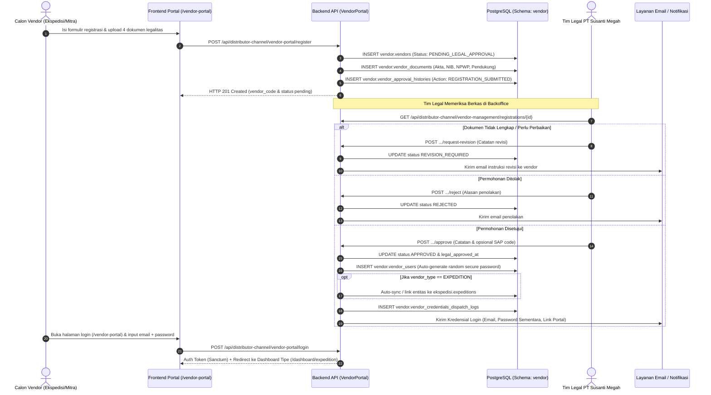
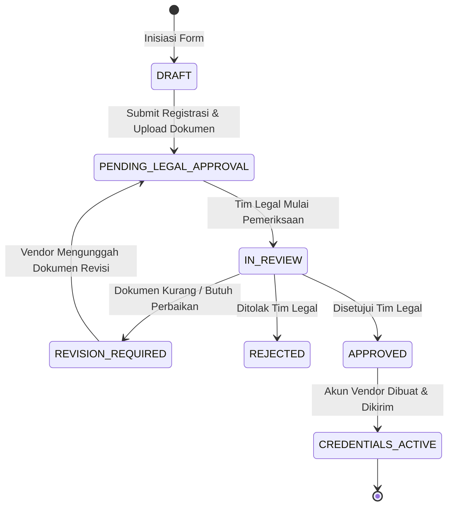
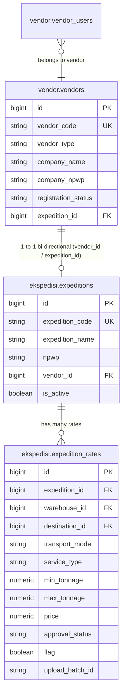
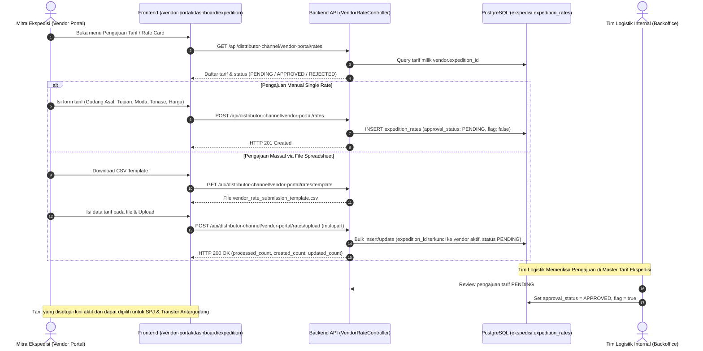

# 🏢 Panduan Teknis Skema Database Vendor, Workflow Registrasi & Approval Legal (Vendor Portal)

Dokumen panduan arsitektur database, skema PostgreSQL `vendor`, alur registrasi mandiri, verifikasi berkas legalitas, dan pengelolaan akun login vendor pada backend SMESTA PT Susanti Megah.

---

## 📌 1. Latar Belakang & Ruang Lingkup

Portal Vendor (`/vendor-portal`) dirancang sebagai pintu onboarding terpadu bagi seluruh mitra bisnis PT Susanti Megah. Mitra awal yang mendaftar adalah **Mitra Ekspedisi (Logistik & Pengiriman)** dan **Mitra Distributor (Distribusi Produk)**, dengan fleksibilitas untuk vendor masa depan seperti supplier bahan baku (*Raw Material*), kemasan (*Packaging*), hingga general contractor.

### Fitur Utama:
1. **Pendaftaran Mandiri (Self-Service Registration):** Calon mitra mengisi profil perusahaan, kontak PIC, dan mengunggah berkas legalitas (Akta, NIB, NPWP, Dokumen Pendukung).
2. **Review & Approval Legalitas:** Tim legal meninjau berkas, meminta revisi, menyetujui, atau menolak permohonan pendaftaran.
3. **Akun & Kredensial Terisolasi:** Akun user vendor disimpan pada tabel khusus `vendor.vendor_users` (terpisah dari user internal `public.users`).
4. **Auto-Link Ekspedisi:** Saat vendor bertipe `EXPEDITION` disetujui, sistem secara otomatis mensinkronkan dan menautkan entitas ke tabel `ekspedisi.expeditions`.

---

## 🗺️ 2. Diagram Alur Bisnis (Workflow)

### 2.1 Sequence Diagram: Registrasi hingga Akses Portal


### 2.2 State Diagram: Siklus Hidup Status Vendor


---

## 🗄️ 3. Struktur Database Skema `vendor`

Skema PostgreSQL: `vendor` (koneksi: `pgsql_vendor`, search path: `vendor,public`).

### 3.1 Tabel `vendor.vendors`
| Nama Kolom | Tipe Data | Nullable | Keterangan |
|:---|:---|:---:|:---|
| `id` | BIGSERIAL PK | Tidak | Identifier unik vendor |
| `vendor_code` | VARCHAR(50) | Tidak | Kode unik format `VND-YYYYMM-XXXX` (Unique, Index) |
| `vendor_type` | VARCHAR(50) | Tidak | `EXPEDITION`, `DISTRIBUTOR`, `RAW_MATERIAL`, `PACKAGING`, `GENERAL_SUPPLIER` |
| `company_name` | VARCHAR(200) | Tidak | Nama legal perusahaan (PT / CV / Firma) |
| `company_email` | VARCHAR(150) | Tidak | Alamat email resmi perusahaan (Index) |
| `company_phone` | VARCHAR(50) | Ya | Nomor telepon kantor |
| `address` | TEXT | Ya | Alamat domisili operasional (Jalan) |
| `village` | VARCHAR(100) | Ya | Desa / Kelurahan |
| `district` | VARCHAR(100) | Ya | Kecamatan |
| `city` | VARCHAR(100) | Ya | Kota |
| `regencies` | VARCHAR(100) | Ya | Kabupaten / Kota |
| `province` | VARCHAR(100) | Ya | Provinsi |
| `postal_code` | VARCHAR(20) | Ya | Kode pos |
| `pic_name` | VARCHAR(150) | Tidak | Nama lengkap penanggung jawab (PIC) |
| `pic_phone` | VARCHAR(50) | Tidak | Nomor telepon seluler / WhatsApp PIC |
| `pic_email` | VARCHAR(150) | Ya | Email personal PIC |
| `terms_agreed` | BOOLEAN | Tidak | Persetujuan syarat kemitraan (Default: true) |
| `terms_agreed_at` | TIMESTAMP | Ya | Waktu pencentangan syarat |
| `registration_status` | VARCHAR(30) | Tidak | `PENDING_LEGAL_APPROVAL`, `REVISION_REQUIRED`, `APPROVED`, `REJECTED` |
| `legal_approval_status`| VARCHAR(30) | Tidak | `PENDING`, `IN_REVIEW`, `APPROVED`, `REJECTED`, `REVISION` |
| `legal_approved_by` | BIGINT | Ya | Foreign Key ke `public.users.id` (Tim Legal) |
| `legal_approved_at` | TIMESTAMP | Ya | Waktu persetujuan legal |
| `legal_notes` | TEXT | Ya | Catatan verifikasi / pertimbangan legal / alasan reject |
| `sap_vendor_code` | VARCHAR(50) | Ya | Kode Business Partner (CardCode) di SAP B1 |
| `expedition_id` | BIGINT | Ya | Foreign Key ke `ekspedisi.expeditions.id` (jika ekspedisi) |
| `distributor_code` | VARCHAR(50) | Ya | Kode relasi ke master distributor (jika distributor) |
| `created_at`, `updated_at`, `deleted_at` | TIMESTAMPS | Ya | Soft deletes |

---

### 3.2 Tabel `vendor.vendor_documents`
| Nama Kolom | Tipe Data | Nullable | Keterangan |
|:---|:---|:---:|:---|
| `id` | BIGSERIAL PK | Tidak | Identifier unik dokumen |
| `vendor_id` | BIGINT FK | Tidak | Relasi ke `vendor.vendors.id` (ON DELETE CASCADE) |
| `document_type` | VARCHAR(50) | Tidak | `AKTA`, `NIB`, `NPWP`, `SUPPORT`, `OTHER` |
| `document_number` | VARCHAR(100) | Ya | Nomor dokumen resmi (No NIB / No NPWP) |
| `file_path` | TEXT | Tidak | Path lokasi berkas di disk storage (`vendor_documents/{code}/...`) |
| `file_name` | VARCHAR(255) | Tidak | Nama berkas asli saat diunggah |
| `file_size` | BIGINT | Tidak | Ukuran berkas dalam bytes |
| `file_mime` | VARCHAR(100) | Ya | Format MIME (`application/pdf`, `image/png`, dll) |
| `verification_status` | VARCHAR(30) | Tidak | `PENDING`, `VALID`, `INVALID`, `NEEDS_REVISION` |
| `verified_by` | BIGINT FK | Ya | Foreign Key ke `public.users.id` (Verifikator Legal) |
| `verified_at` | TIMESTAMP | Ya | Waktu verifikasi berkas |
| `verification_notes` | TEXT | Ya | Catatan evaluasi / alasan revisi verifikator legal |
| `notes` | TEXT | Ya | Catatan berkas (mendukung catatan pendaftar maupun ulasan verifikator) |
| `created_at`, `updated_at` | TIMESTAMPS | Ya | Standar Laravel timestamps |

---

### 3.3 Tabel `vendor.vendor_users` (Kredensial Login Vendor)
| Nama Kolom | Tipe Data | Nullable | Keterangan |
|:---|:---|:---:|:---|
| `id` | BIGSERIAL PK | Tidak | Identifier unik user vendor |
| `vendor_id` | BIGINT FK | Tidak | Relasi ke `vendor.vendors.id` (ON DELETE CASCADE) |
| `name` | VARCHAR(150) | Tidak | Nama pengguna |
| `email` | VARCHAR(150) | Tidak | Email login akun vendor (Unique, Index) |
| `password` | VARCHAR(255) | Tidak | Hash kata sandi (`bcrypt`) |
| `role` | VARCHAR(50) | Tidak | `VENDOR_ADMIN`, `VENDOR_OPERATOR`, `VENDOR_FINANCE` |
| `status` | VARCHAR(30) | Tidak | `ACTIVE`, `INACTIVE`, `BLOCKED` |
| `must_change_password`| BOOLEAN | Tidak | Wajib ganti password saat login awal (Default: true) |
| `initial_password_sent_at` | TIMESTAMP | Ya | Waktu pengiriman kredensial awal |
| `last_login_at` | TIMESTAMP | Ya | Waktu login terakhir |
| `last_login_ip` | VARCHAR(45) | Ya | Alamat IP login terakhir |
| `remember_token` | VARCHAR(100) | Ya | Token sesi remember me |
| `created_at`, `updated_at` | TIMESTAMPS | Ya | Standar Laravel timestamps |

---

### 3.4 Tabel `vendor.vendor_approval_histories` (Audit Trail)
Mencatat seluruh rekam jejak aksi status permohonan vendor:
- `id`, `vendor_id`, `action` (`REGISTRATION_SUBMITTED`, `REVIEW_STARTED`, `REVISION_REQUESTED`, `APPROVED`, `REJECTED`, `CREDENTIALS_GENERATED`), `from_status`, `to_status`, `actor_id`, `actor_name`, `notes`, `created_at`.

---

### 3.5 Tabel `vendor.vendor_credentials_dispatch_logs`
Mencatat histori pengiriman akun login ke mitra setelah disetujui:
- `id`, `vendor_user_id`, `vendor_id`, `recipient_email`, `dispatch_channel` (`EMAIL`/`WHATSAPP`), `dispatch_status` (`SENT`/`FAILED`), `sent_at`, `error_message`, `created_at`.

---

## 🌐 4. Spesifikasi API Endpoint

### 4.1 Endpoint Publik (Frontend Vendor Portal)

#### 1. Registrasi Calon Vendor
- **Method & Path:** `POST /api/distributor-channel/vendor-portal/register`
- **Content-Type:** `multipart/form-data`
- **Request Parameters:**
  | Field | Tipe | Wajib | Keterangan |
  |:---|:---:|:---:|:---|
  | `vendor_type` | string | Ya | `expedition`, `distributor`, dll |
  | `company_name`| string | Ya | Nama resmi perusahaan |
  | `company_email`| string | Ya | Email resmi perusahaan |
  | `pic_name` | string | Ya | Nama penanggung jawab |
  | `pic_phone` | string | Ya | No Handphone / WA PIC |
  | `company_phone` | string | Tidak | No Telepon Kantor |
  | `company_npwp` | string | Tidak | Nomor Pokok Wajib Pajak (NPWP) Perusahaan (15/16 digit) |
  | `address` | string | Tidak | Alamat domisili |
  | `city` | string | Tidak | Kota domisili |
  | `province` | string | Tidak | Provinsi domisili |
  | `postal_code` | string | Tidak | Kode pos |
  | `terms_agreed`| boolean| Ya | Nilai `1` atau `true` |
  | `akta` / `document_akta` | file | Tidak | Berkas Akta Perusahaan (PDF/JPG/PNG, Max 10MB) |
  | `nib` / `document_nib` | file | Tidak | Berkas NIB / Izin Usaha (PDF/JPG/PNG, Max 10MB) |
  | `npwp` / `document_npwp` | file | Tidak | Berkas NPWP Perusahaan (PDF/JPG/PNG, Max 10MB) |
  | `support` / `document_support`| file | Tidak | Berkas Pendukung (PDF/JPG/PNG, Max 10MB) |
- **Response `201 Created`:**
  ```json
  {
    "success": true,
    "message": "Pendaftaran vendor berhasil dikirim. Menunggu verifikasi dokumen legalitas dari tim legal PT Susanti Megah.",
    "data": {
      "vendor_code": "VND-202609-0001",
      "company_name": "PT Jaya Trans Logistik",
      "vendor_type": "EXPEDITION",
      "registration_status": "PENDING_LEGAL_APPROVAL",
      "uploaded_documents_count": 4,
      "created_at": "2026-09-08T14:40:00.000000Z"
    }
  }
  ```

#### 2. Cek Ketersediaan Email
- **Method & Path:** `GET /api/distributor-channel/vendor-portal/check-email?email=vendor@perusahaan.com`
- **Response `200 OK`:**
  ```json
  {
    "available": true,
    "email": "vendor@perusahaan.com",
    "message": "Email tersedia"
  }
  ```

#### 3. Upload Ulang Berkas Dokumen Revisi (Re-Upload Per Berkas)
Digunakan oleh calon vendor untuk mengunggah berkas pengganti yang diminta revisi (`NEEDS_REVISION`) oleh tim legal. File lama akan ditimpa, status dokumen di-reset ke `PENDING`, dan status registrasi vendor kembali ke `PENDING_LEGAL_APPROVAL`.

- **Method & Path:** `POST /api/distributor-channel/v1/vendor-portal/documents/{documentId}/reupload` (atau tanpa `/v1/`)
- **Content-Type:** `multipart/form-data`
- **Request Parameters:**
  | Field | Tipe | Wajib | Keterangan |
  |:---|:---:|:---:|:---|
  | `vendor_code` | string | Ya | Kode vendor resmi calon mitra (contoh: `VND-202609-0001`) |
  | `file` | file | Ya | Berkas perbaikan baru (PDF/JPG/PNG, Max 10MB) |
  | `notes` | string | Tidak | Catatan klarifikasi / perbaikan dari vendor |
  | `document_number` | string | Tidak | Nomor dokumen legalitas jika ada koreksi nomor |
- **Response `200 OK`:**
  ```json
  {
    "success": true,
    "message": "Document re-uploaded successfully. Pending legal document verification.",
    "data": {
      "id": 1,
      "vendor_id": 1,
      "document_type": "AKTA",
      "document_number": "AKTA-001-REV",
      "file_name": "akta_perubahan_2026.pdf",
      "file_url": "https://smesta-dev.susantimegah.com/storage/vendor_documents/VND-202609-0001/akta_VND-202609-0001_abc123.pdf",
      "verification_status": "PENDING",
      "notes": "Berkas akta lembar perubahan direksi 2025 telah diunggah ulang.",
      "verification_notes": null
    }
  }
  ```

#### 4. Login Akun Vendor
- **Method & Path:** `POST /api/distributor-channel/vendor-portal/login`
- **Request JSON:**
  ```json
  {
    "email": "vendor@perusahaan.com",
    "password": "TemporaryPassword123!",
    "vendor_type": "expedition"
  }
  ```
- **Response `200 OK`:**
  ```json
  {
    "success": true,
    "message": "Login vendor berhasil.",
    "data": {
      "token": "1|vendor_token_hash_value_here",
      "token_type": "Bearer",
      "user": {
        "id": 1,
        "name": "Budi Santoso",
        "email": "vendor@perusahaan.com",
        "role": "VENDOR_ADMIN",
        "must_change_password": true
      },
      "vendor": {
        "id": 1,
        "vendor_code": "VND-202609-0001",
        "vendor_type": "EXPEDITION",
        "company_name": "PT Jaya Trans Logistik",
        "company_email": "vendor@perusahaan.com",
        "expedition_id": 12
      },
      "dashboard_url": "/vendor-portal/dashboard/expedition"
    }
  }
  ```

#### 5. Profil Vendor & Berkas Dokumen Terunggah
- **Method & Path:** `GET /api/distributor-channel/vendor-portal/me` (atau `/v1/vendor-portal/me`)
- **Headers:** `Authorization: Bearer <sanctum_token>`
- **Response `200 OK`:**
  ```json
  {
    "success": true,
    "message": "Vendor profile and documents retrieved successfully.",
    "data": {
      "user": {
        "id": 1,
        "name": "Budi Santoso",
        "email": "vendor@perusahaan.com",
        "role": "VENDOR_ADMIN",
        "must_change_password": true
      },
      "vendor": {
        "id": 1,
        "vendor_code": "VND-202609-0001",
        "vendor_type": "EXPEDITION",
        "company_name": "PT Jaya Trans Logistik",
        "company_email": "vendor@perusahaan.com",
        "company_npwp": "01.234.567.8-901.000",
        "expedition_id": 12
      },
      "documents": [
        {
          "id": 1,
          "document_type": "AKTA",
          "document_number": "AKTA-001",
          "file_name": "akta_pendirian.pdf",
          "file_size": 1048576,
          "file_mime": "application/pdf",
          "file_url": "https://smesta-dev.susantimegah.com/storage/vendor_documents/VND-202609-0001/akta.pdf",
          "verification_status": "VALID",
          "notes": "Akta pendirian dan SK Kemenkumham sah.",
          "verified_at": "2026-09-09T08:00:00.000000Z"
        },
        {
          "id": 2,
          "document_type": "NIB",
          "document_number": "NIB-123456",
          "file_name": "nib_oss.pdf",
          "file_size": 524288,
          "file_mime": "application/pdf",
          "file_url": "https://smesta-dev.susantimegah.com/storage/vendor_documents/VND-202609-0001/nib.pdf",
          "verification_status": "VALID",
          "notes": null,
          "verified_at": "2026-09-09T08:00:00.000000Z"
        }
      ]
    }
  }
  ```

#### 6. Ganti Kata Sandi (Change Password)
- **Method & Path:** `POST /api/distributor-channel/vendor-portal/change-password` (atau `/v1/vendor-portal/change-password`)
- **Headers:** `Authorization: Bearer <sanctum_token>`, `Content-Type: application/json`
- **Request JSON:**
  ```json
  {
    "current_password": "TemporaryPassword123!",
    "new_password": "NewSecurePassword456!",
    "new_password_confirmation": "NewSecurePassword456!"
  }
  ```
- **Response `200 OK`:**
  ```json
  {
    "success": true,
    "message": "Password changed successfully.",
    "data": {
      "user_id": 1,
      "email": "vendor@perusahaan.com",
      "must_change_password": false
    }
  }
  ```

---

### 4.2 Endpoint Backoffice (Tim Legal & Manajemen Vendor)

#### 1. Daftar Pendaftaran Vendor
- **Method & Path:** `GET /api/distributor-channel/vendor-management/registrations`
- **Query Params:** `status` (`ALL`, `PENDING_LEGAL_APPROVAL`, `APPROVED`), `vendor_type`, `search`, `page`, `per_page`.

#### 2. Detail Vendor & Berkas Legalitas
- **Method & Path:** `GET /api/distributor-channel/vendor-management/registrations/{id}`

#### 3. Persetujuan Legal (Approval) & Auto-Generate Kredensial
- **Method & Path:** `POST /api/distributor-channel/vendor-management/registrations/{id}/approve`
- **Request JSON:**
  ```json
  {
    "legal_notes": "Seluruh berkas legalitas (Akta, NIB, NPWP) telah terverifikasi valid.",
    "sap_vendor_code": "V-100249",
    "initial_password": "OpsionalPasswordKustom123"
  }
  ```
- **Response `200 OK`:**
  ```json
  {
    "success": true,
    "message": "Pendaftaran vendor berhasil disetujui. Kredensial akun login telah digenerate dan dikirimkan ke email vendor.",
    "data": {
      "vendor_code": "VND-202609-0001",
      "company_name": "PT Jaya Trans Logistik",
      "registration_status": "APPROVED",
      "legal_approval_status": "APPROVED",
      "credentials": {
        "email": "vendor@perusahaan.com",
        "initial_password": "OpsionalPasswordKustom123",
        "portal_login_url": "https://smesta-dev.susantimegah.com/vendor-portal"
      },
      "expedition_linked": {
        "id": 12,
        "expedition_code": "EXP-PTJAYATR-0001",
        "expedition_name": "PT Jaya Trans Logistik"
      }
    }
  }
  ```

> ✉️ **Pengiriman Email Kredensial Otomatis:**
> Saat endpoint approval dieksekusi, sistem secara otomatis mengirimkan email resmi (`App\Mail\VendorCredentialsMail` via template `resources/views/emails/vendor_credentials.blade.php`) ke `company_email` vendor yang berisi URL Portal, Email Login, Password Sementara, dan instruksi keamanan ganti password saat login pertama kali. Status pengiriman email dicatat di tabel `vendor.vendor_credentials_dispatch_logs` (`SENT` atau `FAILED` jika SMTP error tanpa menggagalkan transaksi approval).

#### 4. Penolakan Legal (Reject)
- **Method & Path:** `POST /api/distributor-channel/vendor-management/registrations/{id}/reject`
- **Request JSON:**
  ```json
  {
    "rejection_reason": "Izin usaha NIB tidak sesuai dengan bidang pengiriman logistik garam konsumsi."
  }
  ```
- **Response `200 OK`:**
  ```json
  {
    "success": true,
    "message": "Vendor registration rejected successfully.",
    "data": {
      "vendor_code": "VND-202609-0001",
      "registration_status": "REJECTED",
      "legal_notes": "Izin usaha NIB tidak sesuai dengan bidang pengiriman logistik garam konsumsi."
    }
  }
  ```

> ✉️ **Pengiriman Email Penolakan Otomatis (Rejection Notification):**
> Saat endpoint rejection dieksekusi, sistem secara otomatis mengirimkan email resmi (`App\Mail\VendorRegistrationRejectedMail` via template `resources/views/emails/vendor_rejected.blade.php`) ke `company_email` calon vendor yang mencantumkan nama perusahaan, kode vendor, tanggal review, alasan penolakan (`rejection_reason`) dari tim legal, serta kontak klarifikasi divisi pengadaan/legal PT Susanti Megah.


#### 5. Permintaan Revisi Berkas (Request Revision)
- **Method & Path:** `POST /api/distributor-channel/vendor-management/registrations/{id}/request-revision`
- **Request JSON:**
  ```json
  {
    "revision_notes": "Mohon perbarui Akta Perusahaan dengan lembar perubahan penyesuaian modal terbaru.",
    "document_types": ["AKTA"]
  }
  ```

#### 6. Verifikasi Per Berkas Dokumen (Approve / Reject / Minta Revisi Per Berkas)
- **Method & Path:** `POST /api/distributor-channel/v1/vendor-management/documents/{documentId}/verify`
- **Request JSON:**
  ```json
  {
    "status": "VALID",
    "notes": "Nomor NIB sesuai dan aktif di database OSS."
  }
  ```
  *(Nilai `status`: `VALID` [Dokumen Sah], `NEEDS_REVISION` [Minta Dokumen Diunggah Ulang], atau `INVALID` [Dokumen Palsu/Ditolak])*.
- **Response `200 OK`:**
  ```json
  {
    "success": true,
    "message": "Document verification status updated successfully.",
    "data": {
      "id": 1,
      "vendor_id": 1,
      "document_type": "NIB",
      "verification_status": "VALID",
      "verified_by": 5,
      "verified_at": "2026-09-09T09:54:00.000000Z",
      "verification_notes": "Nomor NIB sesuai dan aktif di database OSS.",
      "notes": "Nomor NIB sesuai dan aktif di database OSS.",
      "file_url": "https://smesta-dev.susantimegah.com/storage/vendor_documents/VND-202609-0001/nib_oss.pdf"
    }
  }
  ```

#### 7. Unggah Ulang Berkas Revisi oleh Vendor (Re-upload Document)
- **Method & Path:** `POST /api/distributor-channel/vendor-portal/documents/{documentId}/reupload` (atau `/v1/vendor-portal/documents/{documentId}/reupload`)
- **Headers:** `Authorization: Bearer <token>` *(Opsional jika sudah login di portal)*, `Content-Type: multipart/form-data`
- **Request Body (`multipart/form-data`):**
  | Field | Tipe | Wajib | Keterangan |
  |:---|:---:|:---:|:---|
  | `file` | file | Ya | Berkas dokumen revisi (.pdf, .jpg, .jpeg, .png, maksimal 10MB) |
  | `notes` | string | Tidak | Catatan klarifikasi atau penjelasan perbaikan dari vendor |
  | `document_number` | string | Tidak | Nomor dokumen baru (jika ada pembaruan nomor dokumen) |
  | `vendor_code` | string | Kondisional | Wajib jika request dilakukan tanpa Bearer Token (public). Otomatis dideteksi dari akun jika request menyertakan Bearer Token. |
- **Perilaku Sistem:**
  - Menghapus berkas lama dari media storage.
  - Menyimpan file baru ke path aman `storage/vendor_documents/{vendor_code}/...`.
  - Mengubah status dokumen menjadi `verification_status = 'PENDING'`.
  - Mereset data verifier (`verified_by = null`, `verified_at = null`).
  - Mencatat riwayat audit pada `vendor.vendor_approval_histories`.
- **Response `200 OK`:**
  ```json
  {
    "success": true,
    "message": "Document re-uploaded successfully. Pending legal document verification.",
    "data": {
      "id": 1,
      "vendor_id": 1,
      "document_type": "AKTA",
      "document_number": "AHU-00123-REV",
      "file_name": "akta_perubahan_2026.pdf",
      "file_size": 425120,
      "file_mime": "application/pdf",
      "verification_status": "PENDING",
      "notes": "Sudah diunggah lembar akta perubahan modal terbaru.",
      "file_url": "https://smesta-dev.susantimegah.com/storage/vendor_documents/VND-202609-0001/akta_VND-202609-0001_xyz123.pdf"
    }
  }
  ```

---

## 🚚 5. Integrasi Vendor Ekspedisi & Pengajuan Tarif (Rate Card)

Setelah calon vendor bertipe `EXPEDITION` disetujui (`APPROVED`) oleh tim legal, sistem secara otomatis menghubungkan vendor tersebut dengan master data ekspedisi (`ekspedisi.expeditions`). Vendor kemudian dapat mengakses menu **Rate Card Management** di Vendor Portal untuk melihat, mengajukan tarif baru secara manual, atau mengunggah spreadsheet daftar tarif secara massal.

### 5.1 Relasi Dua Arah: `vendor.vendors` ↔ `ekspedisi.expeditions`

Relasi antar skema PostgreSQL dibangun secara dua arah (bi-directional foreign keys) untuk menjaga integritas data lintas domain:
- **`vendor.vendors.expedition_id`**: Menunjuk ke `ekspedisi.expeditions.id`.
- **`ekspedisi.expeditions.vendor_id`**: Menunjuk ke `vendor.vendors.id`.
- **Sinkronisasi Otomatis:** Saat tim legal menyetujui vendor ekspedisi, `VendorLegalApprovalService::syncToExpeditionMaster()` memastikan:
  - `expedition_name` disamakan dengan `company_name`.
  - `npwp` disinkronkan dari `company_npwp` vendor.
  - Alamat, telepon, dan status aktif diselaraskan.
  - Relasi dua arah (`vendor_id` & `expedition_id`) terisi penuh.



---

### 5.2 Alur Bisnis Pengajuan & Verifikasi Tarif (Sequence Diagram)



---

### 5.3 Spesifikasi Endpoint Pengajuan Tarif Vendor

Seluruh endpoint di bawah ini mewajibkan header autentikasi `Authorization: Bearer <sanctum_token>` dari user vendor yang berstatus `APPROVED` dan memiliki `vendor_type == 'EXPEDITION'`.

#### 1. Download Template CSV Pengajuan Tarif
- **Method & Path:** `GET /api/distributor-channel/vendor-portal/rates/template` (atau `/v1/vendor-portal/rates/template`)
- **Headers:** `Authorization: Bearer <token>`
- **Response `200 OK`:** Stream file `vendor_rate_submission_template.csv` berisi header resmi dan baris contoh data:
  ```csv
  No,Origin Name,Destination,Transport Mode,Min Weight (Kg),Max Weight (Kg),Service Type,Rate,Lead Time
  1,Gudang Manyar Gresik,CUST-SMG-01,DARAT,0,15000,REGULER,4500000,2
  ```
  *(Catatan: Kolom `Origin Code` tidak perlu karena gudang asal otomatis dicocokkan berdasarkan `Origin Name`. Kolom `Expedition Code` dan `Expedition Name` juga tidak perlu diisi karena otomatis dikaitkan ke vendor ekspedisi yang login)*.

#### 2. Daftar Header Pengajuan Tarif (Batch Summary untuk Tabel Utama FE)
- **Method & Path:** `GET /api/distributor-channel/vendor-portal/rates/headers` (atau `/v1/vendor-portal/rates/headers`)
- **Headers:** `Authorization: Bearer <token>`
- **Query Parameters:** `approval_status` (`PENDING`, `APPROVED`, `REJECTED`), `search`, `date_from`, `date_to`, `page`, `per_page`.
- **Response `200 OK`:**
  ```json
  {
    "success": true,
    "message": "Rate submission headers retrieved successfully.",
    "data": [
      {
        "batch_id": "BATCH-RATE-20260910-001",
        "valid_from": "2026-08-15",
        "valid_until": "2027-08-15",
        "period_label": "2026-08-15 s/d 2027-08-15",
        "approval_status": "PENDING",
        "status": "ACTIVE",
        "total_routes": 25,
        "remarks": "Pengajuan tarif periode 2026-2027",
        "submitted_at": "2026-09-10 11:20:00"
      }
    ],
    "meta": {
      "current_page": 1,
      "last_page": 1,
      "per_page": 15,
      "total": 1
    }
  }
  ```

#### 3. Detail Batch Pengajuan Tarif (Header & Rincian Rute)
- **Method & Path:** `GET /api/distributor-channel/vendor-portal/rates/headers/{batchId}` (atau `/v1/vendor-portal/rates/headers/{batchId}`)
- **Headers:** `Authorization: Bearer <token>`
- **Response `200 OK`:**
  ```json
  {
    "success": true,
    "message": "Rate batch details retrieved successfully.",
    "data": {
      "header": {
        "batch_id": "BATCH-RATE-20260910-001",
        "valid_from": "2026-08-15",
        "valid_until": "2027-08-15",
        "period_label": "2026-08-15 s/d 2027-08-15",
        "approval_status": "PENDING",
        "status": "ACTIVE",
        "total_routes": 25,
        "submitted_at": "2026-09-10 11:20:00",
        "remarks": "Pengajuan tarif periode 2026-2027",
        "expedition": {
          "id": 12,
          "expedition_code": "EXP-PTJAYATR-0001",
          "expedition_name": "PT Jaya Trans Logistik"
        }
      },
      "details": [
        {
          "no": 1,
          "id": 142,
          "origin_code": "PRD01-01",
          "origin_name": "Gudang Manyar Gresik",
          "destination_code": "CUST-SMG-01",
          "destination_name": "Distributor Semarang Makmur",
          "destination_city": "Semarang",
          "transport_mode": "DARAT",
          "service_type": "WINGBOX",
          "min_weight_kg": 0,
          "max_weight_kg": 15000,
          "rate": 4500000,
          "leadtime": 2,
          "eta_days": 2,
          "valid_from": "2026-08-15",
          "valid_until": "2027-08-15",
          "approval_status": "PENDING",
          "flag": false,
          "remarks": null
        }
      ]
    }
  }
  ```

#### 4. Ambil Riwayat Detail Tarif Per Rute
- **Method & Path:** `GET /api/distributor-channel/vendor-portal/rates` (atau `/v1/vendor-portal/rates`)
- **Headers:** `Authorization: Bearer <token>`
- **Query Parameters:** `batch_id`, `approval_status`, `transport_mode`, `warehouse_id`, `destination_id`, `search`, `per_page`.

#### 5. Pengajuan Tarif Baru Secara Manual
- **Method & Path:** `POST /api/distributor-channel/vendor-portal/rates` (atau `/v1/vendor-portal/rates`)
- **Headers:** `Authorization: Bearer <token>`, `Content-Type: application/json`
- **Request JSON:**
  ```json
  {
    "origin": "PRD01-01",
    "destination": "CUST-SMG-01",
    "transport_mode": "DARAT",
    "service_type": "COLD DIESEL DOUBLE (CDD)",
    "min_tonnage": 0,
    "max_tonnage": 5000,
    "price": 2800000,
    "leadtime": 2,
    "min_shipment_qty": 1,
    "max_shipment_qty": 50,
    "valid_from": "2026-08-15",
    "valid_until": "2027-08-15",
    "remarks": "Tarif armada CDD rute Gresik ke Semarang"
  }
  ```

#### 6. Upload Massal Spreadsheet Tarif (Excel / CSV) dengan Periode Pop-up
- **Method & Path:** `POST /api/distributor-channel/vendor-portal/rates/upload` (atau `/v1/vendor-portal/rates/upload`)
- **Headers:** `Authorization: Bearer <token>`, `Content-Type: multipart/form-data`
- **Request Body (`multipart/form-data`):**
  | Field | Tipe | Wajib | Keterangan |
  |:---|:---:|:---:|:---|
  | `file` | file | Ya | File `.xlsx`, `.xls`, atau `.csv` (Maksimal 10MB) dengan header `No,Origin Name,Destination,Transport Mode,Min Weight (Kg),Max Weight (Kg),Service Type,Rate,Lead Time` |
  | `valid_from` | date | Tidak | Tanggal mulai periode (YYYY-MM-DD) dari modal pop-up FE |
  | `valid_until` | date | Tidak | Tanggal selesai periode (YYYY-MM-DD) dari modal pop-up FE |
  | `periode` | string | Tidak | Input tanggal periode tunggal (misal `2026-08-15`, otomatis mengisi `valid_from` dan `valid_until`) |
- **Keamanan & Validasi Khusus Vendor:**
  - Seluruh baris tarif yang diunggah dikunci ke `vendor.expedition_id` akun vendor aktif dan status otomatis `approval_status = 'PENDING'`, `flag = false`.
- **Response `200 OK`:**
  ```json
  {
    "success": true,
    "message": "Rate spreadsheet uploaded and processed successfully. Submitted rates are pending review.",
    "data": {
      "upload_batch_id": "BATCH-RATE-20260910-001",
      "processed_count": 25,
      "created_count": 20,
      "updated_count": 5,
      "skipped_count": 0,
      "errors": []
    }
  }
  ```

---

## 📥 6. Berkas Template Dokumen Legalitas Vendor (Pakta Integritas & Peraturan Kerjasama)

Untuk memudahkan calon mitra vendor dalam mengunggah berkas yang sah, sistem menyediakan direktori dan endpoint publik untuk mengunduh template resmi:

### 6.1 Lokasi Direktori di Server
File template Word (`.docx`) dapat ditaruh manual di salah satu direktori berikut di server:
1. `public/templates/vendor/`
2. `storage/app/public/templates/vendor/`

**Nama Berkas Resmi:**
1. `PAKTA INTEGRITAS VENDOR EKSPEDISI - A4.docx`
2. `PERATURAN KERJASAMA EKSPEDISI.docx`

### 6.2 Endpoint API Download

#### A. Ambil Daftar Template yang Tersedia
- **Endpoint:** `GET /api/distributor-channel/v1/vendor-portal/templates`
- **Response:**
  ```json
  {
    "success": true,
    "status_code": 200,
    "message": "Vendor document templates retrieved successfully.",
    "data": [
      {
        "slug": "pakta-integritas",
        "title": "Pakta Integritas Vendor Ekspedisi",
        "filename": "PAKTA INTEGRITAS VENDOR EKSPEDISI - A4.docx",
        "format": "docx",
        "description": "Template resmi Pakta Integritas bermeterai untuk calon mitra ekspedisi.",
        "is_available": true,
        "download_url": "https://api.domain.com/api/distributor-channel/v1/vendor-portal/templates/pakta-integritas",
        "static_url": "https://api.domain.com/templates/vendor/PAKTA%20INTEGRITAS%20VENDOR%20EKSPEDISI%20-%20A4.docx"
      },
      {
        "slug": "peraturan-kerjasama",
        "title": "Peraturan Kerjasama Ekspedisi",
        "filename": "PERATURAN KERJASAMA EKSPEDISI.docx",
        "format": "docx",
        "description": "Dokumen panduan regulasi & SOP kerjasama operasional armada ekspedisi PT Susanti Megah.",
        "is_available": true,
        "download_url": "https://api.domain.com/api/distributor-channel/v1/vendor-portal/templates/peraturan-kerjasama",
        "static_url": "https://api.domain.com/templates/vendor/PERATURAN%20KERJASAMA%20EKSPEDISI.docx"
      }
    ]
  }
  ```

#### B. Download File Berkas Langsung
- **Endpoint:** `GET /api/distributor-channel/v1/vendor-portal/templates/{slug}`
  - Slug: `pakta-integritas` atau `peraturan-kerjasama` (atau langsung nama file).
- **Header Response:**
  - `Content-Type: application/vnd.openxmlformats-officedocument.wordprocessingml.document`
  - `Content-Disposition: attachment; filename="PAKTA INTEGRITAS VENDOR EKSPEDISI - A4.docx"`

---

## 🔗 Referensi Berkas Terkait
- Dashboard Hub Dokumentasi: [[API_Documentation_Hub|SMESTA API Documentation Hub]]
- Aturan Standar Pengembangan: [[standard_development_rules|Standard Development Rules]]
- Dokumentasi Ekspedisi: [[inventory_transfer_guide|Expedition & Inventory Transfer Guide]]
