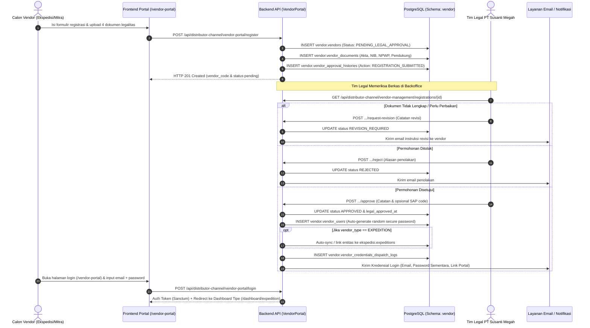
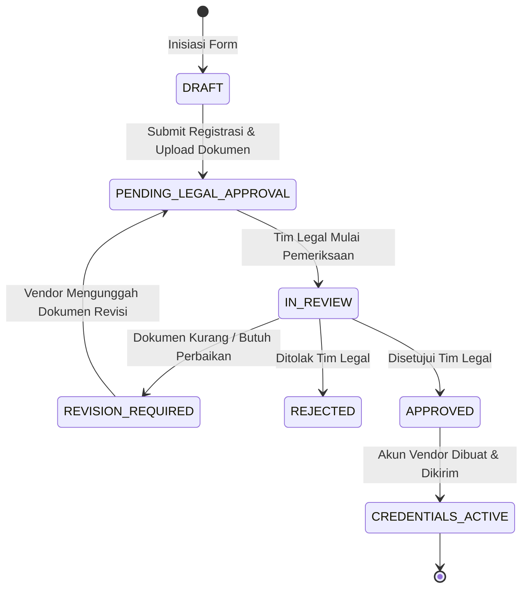

# 🏢 Panduan Teknis Skema Database Vendor, Workflow Registrasi & Approval Legal (Vendor Portal)

Dokumen panduan arsitektur database, skema PostgreSQL `vendor`, alur registrasi mandiri, verifikasi berkas legalitas, dan pengelolaan akun login vendor pada backend SMESTA PT Susanti Megah.

---

## 📌 1. Latar Belakang & Ruang Lingkup

Portal Vendor (`/vendor-portal`) dirancang sebagai pintu onboarding terpadu bagi seluruh mitra bisnis PT Susanti Megah. Mitra awal yang mendaftar adalah **Mitra Ekspedisi (Logistik & Pengiriman)** dan **Mitra Distributor (Distribusi Produk)**, dengan fleksibilitas untuk vendor masa depan seperti supplier bahan baku (*Raw Material*), kemasan (*Packaging*), hingga general contractor.

### Fitur Utama:
1. **Pendaftaran Mandiri (Self-Service Registration):** Calon mitra mengisi profil perusahaan, kontak PIC, dan mengunggah berkas legalitas (Akta, NIB, NPWP, Dokumen Pendukung).
2. **Review & Approval Legalitas:** Tim legal meninjau berkas, meminta revisi, menyetujui, atau menolak permohonan pendaftaran.
3. **Akun & Kredensial Terisolasi:** Akun user vendor disimpan pada tabel khusus `vendor.vendor_users` (terpisah dari user internal `public.users`).
4. **Auto-Link Ekspedisi:** Saat vendor bertipe `EXPEDITION` disetujui, sistem secara otomatis mensinkronkan dan menautkan entitas ke tabel `ekspedisi.expeditions`.

---

## 🗺️ 2. Diagram Alur Bisnis (Workflow)

### 2.1 Sequence Diagram: Registrasi hingga Akses Portal


### 2.2 State Diagram: Siklus Hidup Status Vendor


---

## 🗄️ 3. Struktur Database Skema `vendor`

Skema PostgreSQL: `vendor` (koneksi: `pgsql_vendor`, search path: `vendor,public`).

### 3.1 Tabel `vendor.vendors`
| Nama Kolom | Tipe Data | Nullable | Keterangan |
|:---|:---|:---:|:---|
| `id` | BIGSERIAL PK | Tidak | Identifier unik vendor |
| `vendor_code` | VARCHAR(50) | Tidak | Kode unik format `VND-YYYYMM-XXXX` (Unique, Index) |
| `vendor_type` | VARCHAR(50) | Tidak | `EXPEDITION`, `DISTRIBUTOR`, `RAW_MATERIAL`, `PACKAGING`, `GENERAL_SUPPLIER` |
| `company_name` | VARCHAR(200) | Tidak | Nama legal perusahaan (PT / CV / Firma) |
| `company_email` | VARCHAR(150) | Tidak | Alamat email resmi perusahaan (Index) |
| `company_phone` | VARCHAR(50) | Ya | Nomor telepon kantor |
| `company_npwp` | VARCHAR(50) | Ya | Nomor Pokok Wajib Pajak (NPWP) Perusahaan |
| `address` | TEXT | Ya | Alamat domisili operasional |
| `city` | VARCHAR(100) | Ya | Kota / Kabupaten |
| `province` | VARCHAR(100) | Ya | Provinsi |
| `postal_code` | VARCHAR(20) | Ya | Kode pos |
| `pic_name` | VARCHAR(150) | Tidak | Nama lengkap penanggung jawab (PIC) |
| `pic_phone` | VARCHAR(50) | Tidak | Nomor telepon seluler / WhatsApp PIC |
| `pic_email` | VARCHAR(150) | Ya | Email personal PIC |
| `terms_agreed` | BOOLEAN | Tidak | Persetujuan syarat kemitraan (Default: true) |
| `terms_agreed_at` | TIMESTAMP | Ya | Waktu pencentangan syarat |
| `registration_status` | VARCHAR(30) | Tidak | `PENDING_LEGAL_APPROVAL`, `REVISION_REQUIRED`, `APPROVED`, `REJECTED` |
| `legal_approval_status`| VARCHAR(30) | Tidak | `PENDING`, `IN_REVIEW`, `APPROVED`, `REJECTED`, `REVISION` |
| `legal_approved_by` | BIGINT | Ya | Foreign Key ke `public.users.id` (Tim Legal) |
| `legal_approved_at` | TIMESTAMP | Ya | Waktu persetujuan legal |
| `legal_notes` | TEXT | Ya | Catatan verifikasi / pertimbangan legal / alasan reject |
| `sap_vendor_code` | VARCHAR(50) | Ya | Kode Business Partner (CardCode) di SAP B1 |
| `expedition_id` | BIGINT | Ya | Foreign Key ke `ekspedisi.expeditions.id` (jika ekspedisi) |
| `distributor_code` | VARCHAR(50) | Ya | Kode relasi ke master distributor (jika distributor) |
| `created_at`, `updated_at`, `deleted_at` | TIMESTAMPS | Ya | Soft deletes |

---

### 3.2 Tabel `vendor.vendor_documents`
| Nama Kolom | Tipe Data | Nullable | Keterangan |
|:---|:---|:---:|:---|
| `id` | BIGSERIAL PK | Tidak | Identifier unik dokumen |
| `vendor_id` | BIGINT FK | Tidak | Relasi ke `vendor.vendors.id` (ON DELETE CASCADE) |
| `document_type` | VARCHAR(50) | Tidak | `AKTA`, `NIB`, `NPWP`, `SUPPORT`, `OTHER` |
| `document_number` | VARCHAR(100) | Ya | Nomor dokumen resmi (No NIB / No NPWP) |
| `file_path` | TEXT | Tidak | Path lokasi berkas di disk storage (`vendor_documents/{code}/...`) |
| `file_name` | VARCHAR(255) | Tidak | Nama berkas asli saat diunggah |
| `file_size` | BIGINT | Tidak | Ukuran berkas dalam bytes |
| `file_mime` | VARCHAR(100) | Ya | Format MIME (`application/pdf`, `image/png`, dll) |
| `verification_status` | VARCHAR(30) | Tidak | `PENDING`, `VALID`, `INVALID`, `NEEDS_REVISION` |
| `verified_by` | BIGINT FK | Ya | Foreign Key ke `public.users.id` (Verifikator Legal) |
| `verified_at` | TIMESTAMP | Ya | Waktu verifikasi berkas |
| `verification_notes` | TEXT | Ya | Catatan evaluasi / alasan revisi verifikator legal |
| `notes` | TEXT | Ya | Catatan berkas (mendukung catatan pendaftar maupun ulasan verifikator) |
| `created_at`, `updated_at` | TIMESTAMPS | Ya | Standar Laravel timestamps |

---

### 3.3 Tabel `vendor.vendor_users` (Kredensial Login Vendor)
| Nama Kolom | Tipe Data | Nullable | Keterangan |
|:---|:---|:---:|:---|
| `id` | BIGSERIAL PK | Tidak | Identifier unik user vendor |
| `vendor_id` | BIGINT FK | Tidak | Relasi ke `vendor.vendors.id` (ON DELETE CASCADE) |
| `name` | VARCHAR(150) | Tidak | Nama pengguna |
| `email` | VARCHAR(150) | Tidak | Email login akun vendor (Unique, Index) |
| `password` | VARCHAR(255) | Tidak | Hash kata sandi (`bcrypt`) |
| `role` | VARCHAR(50) | Tidak | `VENDOR_ADMIN`, `VENDOR_OPERATOR`, `VENDOR_FINANCE` |
| `status` | VARCHAR(30) | Tidak | `ACTIVE`, `INACTIVE`, `BLOCKED` |
| `must_change_password`| BOOLEAN | Tidak | Wajib ganti password saat login awal (Default: true) |
| `initial_password_sent_at` | TIMESTAMP | Ya | Waktu pengiriman kredensial awal |
| `last_login_at` | TIMESTAMP | Ya | Waktu login terakhir |
| `last_login_ip` | VARCHAR(45) | Ya | Alamat IP login terakhir |
| `remember_token` | VARCHAR(100) | Ya | Token sesi remember me |
| `created_at`, `updated_at` | TIMESTAMPS | Ya | Standar Laravel timestamps |

---

### 3.4 Tabel `vendor.vendor_approval_histories` (Audit Trail)
Mencatat seluruh rekam jejak aksi status permohonan vendor:
- `id`, `vendor_id`, `action` (`REGISTRATION_SUBMITTED`, `REVIEW_STARTED`, `REVISION_REQUESTED`, `APPROVED`, `REJECTED`, `CREDENTIALS_GENERATED`), `from_status`, `to_status`, `actor_id`, `actor_name`, `notes`, `created_at`.

---

### 3.5 Tabel `vendor.vendor_credentials_dispatch_logs`
Mencatat histori pengiriman akun login ke mitra setelah disetujui:
- `id`, `vendor_user_id`, `vendor_id`, `recipient_email`, `dispatch_channel` (`EMAIL`/`WHATSAPP`), `dispatch_status` (`SENT`/`FAILED`), `sent_at`, `error_message`, `created_at`.

---

## 🌐 4. Spesifikasi API Endpoint

### 4.1 Endpoint Publik (Frontend Vendor Portal)

#### 1. Registrasi Calon Vendor
- **Method & Path:** `POST /api/distributor-channel/vendor-portal/register`
- **Content-Type:** `multipart/form-data`
- **Request Parameters:**
  | Field | Tipe | Wajib | Keterangan |
  |:---|:---:|:---:|:---|
  | `vendor_type` | string | Ya | `expedition`, `distributor`, dll |
  | `company_name`| string | Ya | Nama resmi perusahaan |
  | `company_email`| string | Ya | Email resmi perusahaan |
  | `pic_name` | string | Ya | Nama penanggung jawab |
  | `pic_phone` | string | Ya | No Handphone / WA PIC |
  | `company_phone` | string | Tidak | No Telepon Kantor |
  | `company_npwp` | string | Tidak | Nomor Pokok Wajib Pajak (NPWP) Perusahaan (15/16 digit) |
  | `address` | string | Tidak | Alamat domisili |
  | `city` | string | Tidak | Kota domisili |
  | `province` | string | Tidak | Provinsi domisili |
  | `postal_code` | string | Tidak | Kode pos |
  | `terms_agreed`| boolean| Ya | Nilai `1` atau `true` |
  | `akta` / `document_akta` | file | Tidak | Berkas Akta Perusahaan (PDF/JPG/PNG, Max 10MB) |
  | `nib` / `document_nib` | file | Tidak | Berkas NIB / Izin Usaha (PDF/JPG/PNG, Max 10MB) |
  | `npwp` / `document_npwp` | file | Tidak | Berkas NPWP Perusahaan (PDF/JPG/PNG, Max 10MB) |
  | `support` / `document_support`| file | Tidak | Berkas Pendukung (PDF/JPG/PNG, Max 10MB) |
- **Response `201 Created`:**
  ```json
  {
    "success": true,
    "message": "Pendaftaran vendor berhasil dikirim. Menunggu verifikasi dokumen legalitas dari tim legal PT Susanti Megah.",
    "data": {
      "vendor_code": "VND-202609-0001",
      "company_name": "PT Jaya Trans Logistik",
      "vendor_type": "EXPEDITION",
      "registration_status": "PENDING_LEGAL_APPROVAL",
      "uploaded_documents_count": 4,
      "created_at": "2026-09-08T14:40:00.000000Z"
    }
  }
  ```

#### 2. Cek Ketersediaan Email
- **Method & Path:** `GET /api/distributor-channel/vendor-portal/check-email?email=vendor@perusahaan.com`
- **Response `200 OK`:**
  ```json
  {
    "available": true,
    "email": "vendor@perusahaan.com",
    "message": "Email tersedia"
  }
  ```

#### 3. Login Akun Vendor
- **Method & Path:** `POST /api/distributor-channel/vendor-portal/login`
- **Request JSON:**
  ```json
  {
    "email": "vendor@perusahaan.com",
    "password": "TemporaryPassword123!",
    "vendor_type": "expedition"
  }
  ```
- **Response `200 OK`:**
  ```json
  {
    "success": true,
    "message": "Login vendor berhasil.",
    "data": {
      "token": "1|vendor_token_hash_value_here",
      "token_type": "Bearer",
      "user": {
        "id": 1,
        "name": "Budi Santoso",
        "email": "vendor@perusahaan.com",
        "role": "VENDOR_ADMIN",
        "must_change_password": true
      },
      "vendor": {
        "id": 1,
        "vendor_code": "VND-202609-0001",
        "vendor_type": "EXPEDITION",
        "company_name": "PT Jaya Trans Logistik",
        "company_email": "vendor@perusahaan.com",
        "expedition_id": 12
      },
      "dashboard_url": "/vendor-portal/dashboard/expedition"
    }
  }
  ```

---

### 4.2 Endpoint Backoffice (Tim Legal & Manajemen Vendor)

#### 1. Daftar Pendaftaran Vendor
- **Method & Path:** `GET /api/distributor-channel/vendor-management/registrations`
- **Query Params:** `status` (`ALL`, `PENDING_LEGAL_APPROVAL`, `APPROVED`), `vendor_type`, `search`, `page`, `per_page`.

#### 2. Detail Vendor & Berkas Legalitas
- **Method & Path:** `GET /api/distributor-channel/vendor-management/registrations/{id}`

#### 3. Persetujuan Legal (Approval) & Auto-Generate Kredensial
- **Method & Path:** `POST /api/distributor-channel/vendor-management/registrations/{id}/approve`
- **Request JSON:**
  ```json
  {
    "legal_notes": "Seluruh berkas legalitas (Akta, NIB, NPWP) telah terverifikasi valid.",
    "sap_vendor_code": "V-100249",
    "initial_password": "OpsionalPasswordKustom123"
  }
  ```
- **Response `200 OK`:**
  ```json
  {
    "success": true,
    "message": "Pendaftaran vendor berhasil disetujui. Kredensial akun login telah digenerate dan dikirimkan ke email vendor.",
    "data": {
      "vendor_code": "VND-202609-0001",
      "company_name": "PT Jaya Trans Logistik",
      "registration_status": "APPROVED",
      "legal_approval_status": "APPROVED",
      "credentials": {
        "email": "vendor@perusahaan.com",
        "initial_password": "OpsionalPasswordKustom123",
        "portal_login_url": "https://smesta-dev.susantimegah.com/vendor-portal"
      },
      "expedition_linked": {
        "id": 12,
        "expedition_code": "EXP-PTJAYATR-0001",
        "expedition_name": "PT Jaya Trans Logistik"
      }
    }
  }
  ```

#### 4. Penolakan Legal (Reject)
- **Method & Path:** `POST /api/distributor-channel/vendor-management/registrations/{id}/reject`
- **Request JSON:**
  ```json
  {
    "rejection_reason": "Izin usaha NIB tidak sesuai dengan bidang pengiriman logistik garam konsumsi."
  }
  ```

#### 5. Permintaan Revisi Berkas (Request Revision)
- **Method & Path:** `POST /api/distributor-channel/vendor-management/registrations/{id}/request-revision`
- **Request JSON:**
  ```json
  {
    "revision_notes": "Mohon perbarui Akta Perusahaan dengan lembar perubahan penyesuaian modal terbaru.",
    "document_types": ["AKTA"]
  }
  ```

#### 6. Verifikasi Per Berkas Dokumen (Approve / Reject / Minta Revisi Per Berkas)
- **Method & Path:** `POST /api/distributor-channel/v1/vendor-management/documents/{documentId}/verify`
- **Request JSON:**
  ```json
  {
    "status": "VALID",
    "notes": "Nomor NIB sesuai dan aktif di database OSS."
  }
  ```
  *(Nilai `status`: `VALID` [Dokumen Sah], `NEEDS_REVISION` [Minta Dokumen Diunggah Ulang], atau `INVALID` [Dokumen Palsu/Ditolak])*.
- **Response `200 OK`:**
  ```json
  {
    "success": true,
    "message": "Document verification status updated successfully.",
    "data": {
      "id": 1,
      "vendor_id": 1,
      "document_type": "NIB",
      "verification_status": "VALID",
      "verified_by": 5,
      "verified_at": "2026-09-09T09:54:00.000000Z",
      "verification_notes": "Nomor NIB sesuai dan aktif di database OSS.",
      "notes": "Nomor NIB sesuai dan aktif di database OSS.",
      "file_url": "https://smesta-dev.susantimegah.com/storage/vendor_documents/VND-202609-0001/nib_oss.pdf"
    }
  }
  ```

---

## 🔗 Referensi Berkas Terkait
- Dashboard Hub Dokumentasi: [[API_Documentation_Hub|SMESTA API Documentation Hub]]
- Aturan Standar Pengembangan: [[standard_development_rules|Standard Development Rules]]
- Dokumentasi Ekspedisi: [[inventory_transfer_guide|Expedition & Inventory Transfer Guide]]
